\pagebreak

# Getting Started

## What is *geomorph*?
*geomorph* is a freely available software package for geometric morphometric analyses of two- and three-dimensional landmark (shape) data in the *R* statistical computing environment. It can be installed from the Comprehensive *R* Archive Network, CRAN <http://cran.r-project.org/web/packages/geomorph/>.
Occasionally, we make updates between uploads to CRAN. Users can install via GitHub the current beta version from <https://github.com/geomorphR/geomorph>.  

How to cite: When using *geomorph* in publications, please cite the software with version and the publication. 
```{r comment=""}
citation(package="geomorph")
```
Also, since the package is quickly evolving, it is advisable to cite the CRAN package and version as: 

Adams, D.C., M. L. Collyer, and E. Sherratt. 2016 *geomorph*: Software for geometric morphometric analyses. *R* package version 3.x http://cran.r-project.org/web/packages/geomorph/index.html.  

## How to use this manual
This manual is not meant to be exhaustive – the benefit of working within the *R* environment is its flexibility and infinite possibilities. Instead, the manual presents the functions in *geomorph* and how they can be used together to perform analyses to address a variety of questions in Biology, Anthropology, Paleontology, Archaeology, Medicine etc. This help guide is structured according to the pipeline outlined in **Figure 1**, which is based on a general workflow for morphometric analysis.  


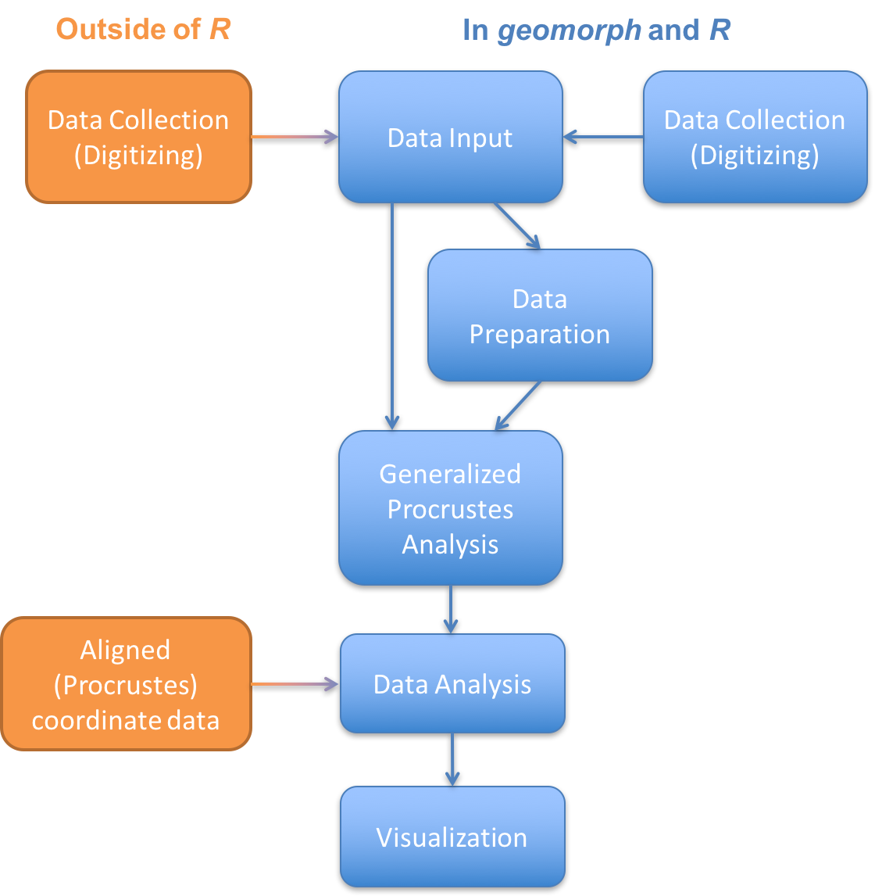

**Figure 1** Overview of the morphometric analysis process. In blue are the steps performed in *R* and *geomorph*, and those in orange are done outside of *R* and imported in. 


In **chapter 2**, we go over how to import data files of (raw) landmark coordinates digitized elsewhere, e.g., using software such as ImageJ or tpsDig for 2D data, or IDAV Landmark editor, AMIRA, Microscribe for 3D data (note that data collection – digitizing landmarks – can also be done in *geomorph*, and is outlined in **chapter 13**). Then **chapter 3** we demonstrate some techniques and functions for preparing and manipulating imported datasets, such as adding grouping variables and estimating missing data, and adjusting articulated datasets (2D only). Note that some functions described in this section can also be used on Procrustes coordinate data, but are presented here because they are important steps to learn familiarize the user with the *R* environment. In **chapter 4** the raw data are taken through the morphometric-specific step of alignment using a generalized Procrustes superimposition, which is imperative for raw coordinate data. In **chapters 5-8**, the statistical analysis functions are presented in order by type of analysis (**Table 1**). In **chapters 9-13**, we describe how to plot and visualize the data analysis results, including shape deformation graphs and ordination plots (e.g., PCA). In **chapter 14** the functions that can be used to generate coordinate data from 2D images and 3D surface files (i.e., an ASCII .ply) are discussed. In **chapter 15** there are some frequently asked questions and their solutions, and **chapter 15** gives references listed in this guide.

\pagebreak

**Table 1** Functions in *geomorph*.

Input | Preparation | Analysis
------------- | ------------- | ------------- 
read.morphologika |	arrayspecs |	advanced.procD.lm	
readland.nts | define.links	| bilat.symmetry	
readland.tps | define.modules	| compare.evol.rates	
readmulti.nts	| estimate.missing	| compare.multi.evol.rates	
|| findMeanSpec	| globalIntegration	
|| fixed.angle | gpagen
||	mshape |	integration.test	
||	two.d.array	| morphol.disparity	
||	writeland.tps	| phylo.integration	
||| phylo.modularity
|||	physignal
||| procD.lm				
|||	procD.pgls		
|||	trajectory.analysis		
||| two.b.pls

Visualization | Datasets | Digitizing
------------- | ------------- | ------------- 
procD.allometry	| hummingbirds	| buildtemplate 
gridPar	| mosquito	| define.sliders
plotAllSpecimens	| motionpaths	| digit.curves
plotGMPhyloMorphoSpace	| plethodon |	digit.fixed
plotOutliers	| plethspecies	| digitize2d | fixed.angle	
plotRefToTarget	| plethShapeFood	| digitsurface
plotspec |	pupfish	| editTemplate
plotTangentSpace	| ratland	| read.ply
warpRefMesh	| scallopPLY	
warpRefOutline	| scallops	
||larvalTails

Throughout this manual, we will use the following abbreviations as is conventional in morphometrics and *R*: 
  `n`	 number of specimens/individuals    
  `p`	 number of landmarks  
  `k`	 number of dimensions  
  `#`	 a comment, in *R* this is text that is ignored (not run)  
  `...`	 data not shown, or if inside a function then other options allowed  
  `code` 	 code to be written into the *R* console  
  `[1]`	 in a code example at the start of a line, a number in brackets denotes the first element of the output and is not intended to be typed  

Briefly understanding functions; below is a *geomorph* function annotated by color:  

```{r eval=FALSE}
procD.allometry(f1, f2 = NULL, f3 = NULL, logsz = TRUE, iter = 999,
  seed = NULL, alpha = 0.05, RRPP = TRUE, data = NULL, ...)

readland.tps(file, specID = c("None", "ID", "imageID"), readcurves = FALSE,
  warnmsg = TRUE) 

# this is a comment; it is not code and is ignored
```

In dark blue, the function name and options. In black, an object, usually data, a formula of data, or sometimes a file name. In green, a multipart option, requires choice of ONE of the presented values. In brown, a logical option that requires a TRUE or FALSE input, or an option that requires a value. In blue, an option that requires a numeric value. # in brown is a comment- this is ignored by R and used simply to tell you what the code before or after it does. 

Usually only the objects are necessary to run a function, as it will use the defaults for the options (which are presented in the function as above, and under "usage" in the *R* help pages). Always read the help pages and check the examples for usage. Order does not matter as long as the option is written in full, e.g., A= mydata. But " " are important, e.g., ``method = "RegScore"``.

Finally, I occasionally write source code for very specific issues to complement *geomorph* functions. They can be found here:  <http://emsherratt.github.io/MorphometricSupportCode/>.

## Installing *geomorph* and *R*
These instructions assume you already have *R* (and perhaps also RStudio) installed.

To install *geomorph* from CRAN
```{r eval=FALSE}
install.packages("geomorph", dependencies = TRUE)
```
This will install the latest version of *geomorph* from CRAN <https://cran.rstudio.com/>.  

Alternatively, if you prefer menus:  
**Rapp**: Packages & Data >  Package Installer >  Choose CRAN (binaries) from drop down menu, type *geomorph* in box and click get list. Select *geomorph*, select install dependencies box, and click install selected.  
or  
**Rstudio**: Packages tab > Install: Install from CRAN repository >  type *geomorph* in box and select install dependencies box, and click install.  

### Installing from GitHub
CRAN restricts the number of updates package maintainers can make in a year. Occasionally, bugs slip through that need to be fixed immediately. We maintain a "Stable" version of the current CRAN version of *geomorph* in our GitHub repository, which can be installed as source.

To install the source package from GitHub:
```{r eval=FALSE}
install.packages("devtools", dependencies = TRUE)
devtools::install_github("geomorphR/geomorph",ref = "Stable")
```

### Installing the beta version
We have a beta version for the upcoming version that contains the most current updates and new features. It is held on a GitHub repository:

To install the beta *geomorph* package:
```{r eval=FALSE}
devtools::install_github("geomorphR/geomorph",ref = "Develop")
```

#### Installing compilers for Mac users:
Previous versions of *geomorph* required users to have compilers installed in order to install packages from source. This is no longer necessary from *geomorph* version 3.0. However the information is provided here if any issues arise.

1)	Go to the Mac App store and download Xcode Development Tools <https://itunes.apple.com/au/app/xcode/id497799835?mt=12> and follow install instructions.
For OS10.6, follow the instructions here <http://kitcambridge.tumblr.com/post/17778742499/installing-the-xcode-command-line-tools-on-snow>.

2)	Download the compilers. For OS10.8 and below: go to CRAN website here and download the GNU Fortran compiler (gfortran-4.2.3.pkg) and follow install instructions. For OS10.9 and above: Open Terminal (Applications/Utilities) and type in:

> `curl -O http://r.research.att.com/libs/gfortran-4.8.2-darwin13.tar.bz2`

This will download the installer. Then type

> `sudo tar fvxz gfortran-4.8.2-darwin13.tar.bz2 -C /`

This will install the compilers into the /usr/local/lib/ folder. The command sudo will ask for your password. Type it in, but note it will not appear on the line. Press return. The terminal window will fill with all the files being written. (This information is thanks to the The Coatless Professor http://r.research.att.com/libs/gfortran-4.8.2-darwin13.tar.bz2 sudo tar fvxz gfortran-4.8.2-darwin13.tar.bz2 -C /).

3)	Download and install XQuartz (X11) <http://xquartz.macosforge.org/trac> if it is not already on your Mac. It will be installed in the Utilities folder. This program must be running every time you use *geomorph* (required by rgl).

This is a short version of information available here <http://cran.r-project.org/bin/macosx/tools/> and here <http://r.research.att.com/tools/>. 

#### Installing compilers for Windows users:
Go to the *R* website and download RTools <http://cran.rstudio.com/bin/windows/Rtools>. Make sure to download the correct version!
Follow the install instructions.
You may need to modify the path (asked during the installing). Try first without ticking the box on the install window. If running `install_github` above does not work then re-install the RTools with the new path box ticked). Alternatively, use the function `find_rtools` in devtools package.

For more information for Windows users, see here <http://cran.r-project.org/doc/manuals/R-admin.html#The-Windows-toolset>.

### Using *geomorph*
Regardless of how you install *geomorph*, in order to use it you must start every session by loading the package
```{r , comment=""}
library(geomorph)
```
You'll notice that a black warning message is printed in the console saying the package rgl and ape are also loaded. All of the 3D plots of interactive functions of *geomorph* are run through rgl <https://cran.r-project.org/web/packages/rgl/index.html>. ape is called for several phylogenetic analyses.

\pagebreak

## Workflows for common analyses
Below are some pathways to perform common analyses in *geomorph*. This is not an exhaustive list, but provides a reference for users familiar with other morphometric software to navigate the functions. In red the type of question or analysis is presented, and in blue the specific *geomorph* functions in sequence. 

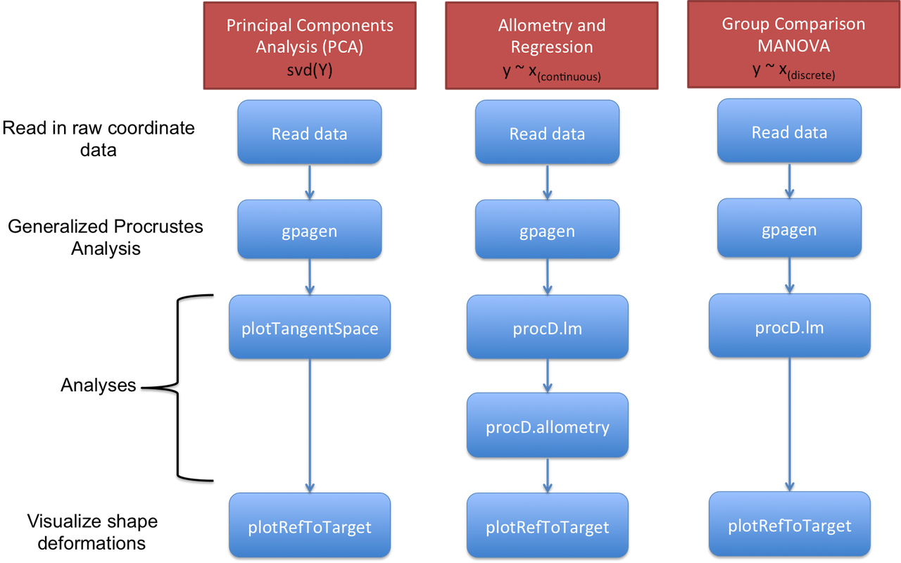
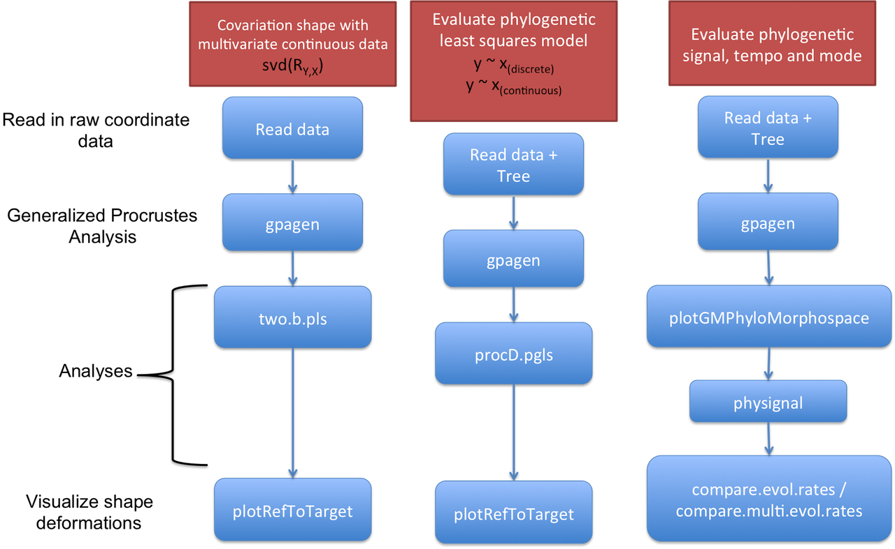
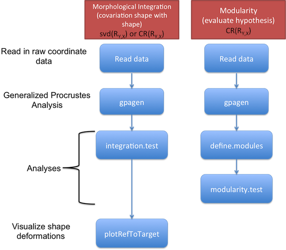

**Figure 2** Example workflows in geomorph of morphometric analyses


## Example datasets in *geomorph*
For chapters II through IV, many of the examples will be using data included with *geomorph*. There are ten datasets: `plethodon`, `scallops`, `hummingbirds`, `larvalTails`, `mosquito`, `ratland`, `plethspecies`, `plethShapeFood`, `motionpaths` and `scallopPLY`. It is advised to run and examine these example datasets before performing own analyses in order to understand how a function and its options work, and how one’s datasets should be formatted.  
To load an example dataset:
```{r comment = ""}
data(plethodon)
attributes(plethodon)
head(plethodon$land[,,1])
head(plethodon$links)
plethodon$species
plethodon$site
head(plethodon$outline)
```

The dataset above, `plethodon`, is a `list` containing several components: the coordinate data (`plethodon$land`), two sets of grouping variables as factors (`plethodon$species`, `plethodon$site`), the wirelink addresses (`plethodon$links`), and an matrix of outline coordinates for visualizations (`plethodon$outline`).
```{r comment = ""}
class(plethodon$site)
class(plethodon$land)
class(plethodon$links)
```
Note that your own data will not necessary be a list - depending on how you read in each element of your data to *R*. However, learning how to manipulate the example datasets here will give you practice for working with lists later on.

Many of the novice user problems when using *geomorph* and *R* stem from having the object input in the wrong format. Here are some useful base functions in *R* to help understand formatting of one’s data:
```{r eval=FALSE}
class() # Object Classes
attributes() # Object Attribute Lists
dim() # Dimensions of an Object
nrow() ;  ncol() # The Number of Rows/Columns of a 2D array
dimnames() # Dimnames of an Object
names() # The Names of an Object
rownames() ; colnames() # Row and Column Names
is.numeric() # very useful to know if the data are numeric
```
*geomorph* primarily has data stored in a 2D array or 3D array (matrix and array respectively) (see below and section 2.1), grouping variables are vectors and factors, and outputs of functions may be lists. For more information about the object classes in *R* see <http://www.statmethods.net/input/datatypes.html>

###	Data arrays 
Landmark data in *geomorph* can be found as objects in two formats: a 2D array (matrix; Figure 3A) or a 3D array (Figure 3B). These data formats follow the convention in other morphometric packages (e.g., shapes, Morpho) and in J.Claude’s book Morphometrics in *R* (2008), and help to distinguish Shape Variables from other continuous morphometric data (linear measurements).

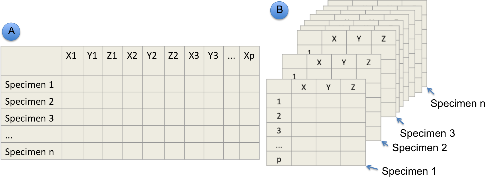
**Figure 3** 2D array and 3D array of landmark coordinate data. NOTE: This example shows 3D landmark coordinate data, but the same format would be used for 2D coordinate data.

#### 3D array (p x k x n)
An array with three dimensions, i.e., number of rows (p), number of columns (k) and number of “sheets” (n). Imagine a 3D array like a stack of filing cards. Data in this format are needed for most *geomorph* analysis functions. If one has inputted data using `readland.nts()`, `readmulti.nts()`, `readland.tps()`, `read.morphologika()`, then the data will be a 3D array object. Check by typing
```{r comment = ""}
dim(plethodon$land)
```
If `dim()` gives three numbers, it is a 3D array. Here mydata has p=12, k=2, n=40. If `dim()` gives two numbers, it is a 2D array (a matrix). 

#### 2D array (n x [p x k]) 
An array (matrix) with two dimensions, i.e., number of rows (n) and number of columns (p*k).
```{r comment = ""}
dim(two.d.array(plethodon$land))
```
The 2D array is most commonly the format for other variables (n x variables), such as interlandmark distances.

###	*geomorph* data frame 
A data frame in *R* is usually used for storing tables data tables. In *geomorph* a `geomorph.data.frame` is a special list that contains all data to be used in your analyses. The purpose is similar to the base *R* function, `data.frame`, but without the constraint that data must conform to an `n` (observations) x `p` (variables) matrix. Rather, the list produced is constrained only by `n`. List objects can be Procrustes residuals (coordinates) arrays, matrices, variables, distance matrices, and phylogenetic trees. Results from `gpagen` can be directly imported into a geomorph.data.frame to utilize the coordinates and centroid size as variables. The `geomorph.data.frame` is of particular importance when using the functions: `procD.lm`, `procD.pgls`, `advanced.procD.lm`, `morphol.disparity`, `trajectory.analysis`.

## Permutation tests
Many of the function in *geomorph* test for statistical significance using a permutation procedure (e.g., Good 2000). A randomization test takes the original data, shuffles and resamples, calculates the test statistic and compares this to the original. This is repeated for a number of iterations, creating a distribution of random tests statistics in which the original can be evaluated. The proportion of random samples that provide a better fit to the data than the original provides the P-value. Therefore the number of decimal places for the P-value is correlated to the number of iterations. When deciding how many iterations to use more is better. However there is a point where it is time consuming and not helpful (Adams and Anthony 1996). The default in *geomorph* is 999, up to 10,000 is reasonable. The examples in this manual and on the package help files are usually very low to make them fast to run, and it is not recommended to run the function at these small iterations for one’s own data.
In several functions (e.g., `procD.lm`, `procD.gls`, `advanced.procD.lm`, `procD.allometry`), two possible resampling procedures are provided. First, if `RRPP=FALSE`, the rows of the matrix of shape variables are randomized relative to the design matrix. This is analogous to a 'full' randomization. Second, if `RRPP=TRUE`, a residual randomization permutation procedure is utilized (Collyer et al. 2014). Here, residual shape values from a reduced model are obtained, and are randomized with respect to the linear model under consideration. These are then added to predicted values from the remaining effects to obtain pseudo-values from which SS are calculated. NOTE: for single-factor designs, the two approaches are identical. However, when evaluating factorial models it has been shown that RRPP attains higher statistical power and thus has greater ability to identify patterns in data should they be present (see Anderson and terBraak 2003).

## Statistical Designs
For functions requiring a linear model formula, `f1`, the following is a guide for different models:

An expression of the form y ~ model is interpreted as a specification that the response y is modelled by a linear predictor specified symbolically by model.  

Common designs | f1
------------- | ------------- 
Simple Linear Regression | `y ~ x`
Single-factor MANOVA	| `y ~ a`
Single-factor MANCOVA	| `y ~ x * a` 
Multiple-factor MANOVA |	`y ~ a + b`
Factorial MANOVA |	`y ~ a * b`  
Nested MANOVA |	`y ~ a / b`

NOTE: * denotes interaction. Suggested reading: http://www.statmethods.net/stats/anova.html

For models that have 3 or more factors the option `int.first = TRUE/FALSE` is important. TRUE adds the interactions of first main effects before the subsequent main effects.  FALSE adds them in order, for example, the model: 
`shape ~ a*b*c`   
`int.first = FALSE : shape ~ a + b + c + a:b + a:c + b:c + a:b:c`  
`int.first = TRUE : shape ~ a + b + a:b + c +  a:c + b:c + a:b:c`   

For one or two factors, this is inconsequential and thus `int.first` can be left at default.

Finally, this manual only covers *geomorph* functions. It is recommended that users look to some “getting started with *R*” resources, such as [**Quick-R**](http://www.statmethods.net/), and the [**R Introduction manual**](http://cran.r-project.org/doc/manuals/R-intro.pdf), and various Springer eBooks in the series ‘Use *R*!’. Also highly recommended is J. Claude’s book Morphometric with *R* (2008).

\pagebreak

# Data Input: Importing landmark data
##	TPS files (`readland.tps`)
**Function**   
```{r eval=FALSE}
readland.tps(file, specID = c("None", "ID", "imageID"), readcurves = FALSE, warnmsg = T)
```

**Arguments**    
 * *file*	A .tps file containing two- or three-dimensional landmark data  
 * *specID*	a character specifying whether to extract the specimen ID names from the ID or IMAGE lines (default is "None")  
 * *readcurves*	A logical value stating whether CURVES= field and associated coordinate data will be read as semilandmarks (TRUE) or ignored (FALSE)  
 * *warnmsg*	A logical value stating whether warnings should be printed  

This function reads a .tps file containing two- or three-dimensional landmark coordinates for a set of specimens. Tps files are text files in one of the standard formats for geometric morphometrics (see Rohlf 2010). Two-dimensional landmarks coordinates are designated by the identifier "LM=", while three-dimensional data are designated by "LM3=". Landmark coordinates are multiplied by their scale factor if this is provided for all specimens. If one or more specimens are missing the scale factor (there is no line “SCALE=”), landmarks are treated in their original units.   

The name of the specimen can be given in the tps file by “ID=” (use specID=”ID”) or “IMAGE=” (use specID= “imageID”), otherwise the function defaults to specID= “None”. 

If there are curves defined in the file (i.e., CURVES= fields), the option readcurves should be used. When readcurves = TRUE, the coordinate data for the curves will be returned as semilandmarks and will be appended to the fixed landmark data. Then the user needs to use define.sliders to create a matrix designating how the curve points will slide (used by 'curves=' in gpagen). When readcurves = FALSE, only the landmark data are returned (the curves are ignored).
At present, all other information that can be contained in tps files (comments, variables, radii, etc.) is ignored.
E.g. a text file called "ratland.tps" in the .tps format:
```{}
ratland.tps
LM=8
-0.45 -0.475
-0.59 -0.28
-0.515 -0.12
-0.33 0
0 0
0.145 -0.395
-0.045 -0.42
-0.26 -0.465
ID = specimen103N

LM=8
...
```
To read into *R*:
```{r eval=FALSE}
mydata <- readland.tps("ratland.tps", specID = "ID")
[1] "Not all specimens have scale. Using scale = 1.0"
mydata[,,1]
       [,1]   [,2]
[1,] -0.450 -0.475
[2,] -0.590 -0.280
[3,] -0.515 -0.120
[4,] -0.330  0.000
[5,]  0.000  0.000
[6,]  0.145 -0.395
[7,] -0.045 -0.420
[8,] -0.260 -0.465
```
In this case, there is no scale given in the tps file, so the command warns that the data are treated in their original units. The function returns a 3D array containing the coordinate data, and if provided in the file, the names of the specimens (dimnames(mydata)[[3]]).

##	NTS files (`readland.nts`)
**Function**    
```{r eval=FALSE}
readland.nts(file)
```

**Arguments**   

 * *file*	A .nts file containing two- or three-dimensional landmark data for a set of specimens

Function reads a single .nts file containing a matrix of two- or three-dimensional landmark coordinates for a set of specimens. NTS files are text files in one of the standard formats for geometric morphometrics (see Rohlf 2012). The parameter line contains 5 or 6 elements, and must begin with a "1" to designate a rectangular matrix. The second and third values designate how many specimens (n) and how many total variables (p x k) are in the data matrix. The fourth value is a "0" if the data matrix is complete and a "1" if there are missing values. If missing values are present, the '1' is followed by the arbitrary numeric code used to represent missing values (e.g., -999). These values will be replaced with "NA" in the output array. The final value of the parameter line denotes the dimensionality of the landmarks (2,3) and begins with "DIM=". If specimen and variable labels are included, these are designated placing an "L" immediately following the specimen or variable values in the parameter file. The labels then precede the data matrix. Here there are n = 44 and p*k = 50 (25 2D landmarks). 
E.g. For a file that looks like:
```{}
rats.nts

" rats data, 164 rats, 8 landmarks in 2 dimensions

1 164 16 0 dim=2
-0.450 -0.475 -0.590 -0.280 -0.515 -0.120 -0.330 0 0 0 0.145 -0.395 -0.045 -0.420 -0.260 -0.465
-0.530 -0.555 -0.685 -0.320 -0.625 -0.120 -0.400 0 0 0 0.230 -0.425 -0.005 -0.480 -0.265 -0.525
-0.560 -0.570 -0.700 -0.335 -0.670 -0.120 -0.425 0 0 0 0.300 -0.440 0.015 -0.495 -0.270 -0.540
-0.590 -0.580 -0.745 -0.355 -0.700 -0.100 -0.435 0 0 0 0.330 -0.445 0.030 -0.505 -0.285 -0.565
-0.650 -0.580 -0.800 -0.340 -0.715 -0.090 -0.450 0 0 0 0.360 -0.445 0.040 -0.515 -0.300 -0.580
...
```
To read into *R*:
```{r eval=FALSE}
mydata <- readland.nts("rats.nts")
mydata[,,1]
       [,1]   [,2]
[1,] -0.450 -0.475
[2,] -0.590 -0.280
[3,] -0.515 -0.120
[4,] -0.330  0.000
...
```

The function returns a 3D array containing the coordinate data, and if provided in the file, the names of the specimens (dimnames(mydata)[[3]]).
Function is for *.nts file containing landmark coordinates for multiple specimens. Note that *.dta files in the nts format written by Landmark Editor <http://graphics.idav.ucdavis.edu/research/projects/EvoMorph>, and *.nts files written by Stratovan Checkpoint <http://www.stratovan.com/> have incorrect header notation; every header is 1 n p-x-k 1 9999 Dim=3, rather than 1 n p-x-k 0 Dim=3, which denotes that missing data is in the file even when it is not. NAs will be introduced unless the header is manually altered.

##	Multiple NTS files of single specimens (`readmulti.nts`)
**Function**    
```{r eval=FALSE}
readmulti.nts(filelist)
```

**Arguments**   

 * *filelist*	A vector of names of .nts files containing two- or three-dimensional landmark data

This function reads a list containing the names of multiple *.nts files, where each *.nts file contains the landmark coordinates for a single specimen, e.g. made by digit.fixed. For these files, the number of variables (columns) of the data matrix will equal the number of dimensions of the landmark data (k = 2 or 3). The parameter line contains 5 or 6 elements, and must begin with a "1" to designate a rectangular matrix. The second and third values designate the number of landmarks (p) and the dimensionality of the data (k) in the data matrix. The fourth value is a "0" if the data matrix is complete and a "1" if there are missing values. If missing values are present, the '1' is followed by the arbitrary numeric code used to represent missing values (e.g., -999). These values will be replaced with "NA" in the output array. The final value of the parameter line denotes the dimensionality of the landmarks (2,3) and begins with "DIM=". The specimen label is extracted from the file name, not the header. Here is an example of 3 .nts files, each p = 166, k = 3. These are then read and concatenated into a single 3D array for all specimens.

```{r eval=FALSE}
filelist <- list.files(pattern = ".nts")
filelist
[1] “ball01L.nts”  “ball02L.nts”   “ball03L.nts” ...
```
Where the file looks like:
```{}
ball01L.nts

1 166 3 0 dim=3
37.366242091765  -19.7782715772904  -1.45757328357893
45.336342091765  -15.9657715772904  -4.28288328357893
45.562042091765  -1.20527157729041  -5.17616328357893
47.607342091765  13.3546284227096  -6.41333328357893
39.940142091765  18.5793284227096  -4.27434328357893
-44.504657908235  0.138928422709595  -5.40957328357893
-2.61418790823501  47.4933284227096  -3.09240328357893
-8.00038890823501  -45.0109715772904  2.45829671642107
30.500142091765  35.9411284227096  -2.80191328357893
...
```
To read into *R*:
```{r eval=FALSE}
mydata <- readmulti.nts(filelist)
mydata
, , ball01L

              [,1]         [,2]        [,3]
  [1,]  37.3662421 -19.77827158 -1.45757328
  [2,]  45.3363421 -15.96577158 -4.28288328
  [3,]  45.5620421  -1.20527158 -5.17616328
  [4,]  47.6073421  13.35462842 -6.41333328
  [5,]  39.9401421  18.57932842 -4.27434328
...
```

The function returns a 3D array containing the coordinate data, and the names of the specimens (dimnames(mydata)[[3]]) extracted from the file names.

##	Morphologika files (`read.morphologika`)
**Function**    
```{r eval=FALSE}
read.morphologika(file)
```

**Arguments**

 * *file*	A .txt file containing two- or three-dimensional landmark data for a set of specimens

This function reads a .txt file in the Morphologika format containing two- or three-dimensional landmark coordinates. Morphologika files are text files in one of the standard formats for geometric morphometrics (see O'Higgins and Jones 1998), see http://sites.google.com/site/hymsfme/resources. If the headers "[labels]" , "[labelvalues]" and "[groups]" are present in the file, then a data matrix containing all individual specimen information is returned. If the header "[wireframe]" is present, then a matrix of the landmark addresses for the wireframe is returned. If the header "[polygon]" is present, then a matrix of the landmark addresses for the polygon wireframe is returned.

The file looks like:
```{}
morphologikaexample.txt
[individuals]
15
[landmarks]
31
[Dimensions]
3
[names]
Specimen 1
Specimen 2
Specimen 3
...
Specimen 15
[labels]
Sex
[labelvalues]
Female
Female
...
Female
[rawpoints]
'#1
16.01  24.17  11.18
15  24.86  11.16
14.96  25.54  11.52
16.26  24.36  11.48
15.89  26.61  11.83
17.16  25.33  12.35
18.22  23.65  11.12
...
```

To read into *R*:
```{r eval=FALSE}
mydata <- read.morphologika("morphologikaexample.txt")
mydata$coords[,,1]
       [,1]  [,2]  [,3]
 [1,] 16.01 24.17 11.18
 [2,] 15.00 24.86 11.16
 [3,] 14.96 25.54 11.52
 [4,] 16.26 24.36 11.48
 [5,] 15.89 26.61 11.83
 [6,] 17.16 25.33 12.35
...
mydata$labels
           Sex     
Specimen 1  "Female"
Specimen 2  "Female"
Specimen 3  "Female"
Specimen 4  "Female"
Specimen 5  "Male"  
Specimen 6  "Male"  
...
```

The function returns a 3D array containing the coordinate data, and if provided, the names of the specimens (dimnames(mydata)[[3]]). If other optional headers are present in the file (e.g., "[labels]" or "[wireframe]") function returns a list containing the 3D array of coordinates ($coords), and a data matrix of the data from labels ($labels) and/or the landmark addresses denoting the wireframe ($wireframe) – which can be passed to plotRefToTarget option 'links'.   

To read multiple Morphologika files that each contain a single specimen, download this file (https://github.com/EmSherratt/MorphometricSupportCode/blob/master/read.multi.morphologika.R) put in the working directory then to use:
```{r eval=FALSE}
source("read.multi.morphologika.R")
filelist <- list.files(pattern = "*.txt") ## list all morpholgika files
mydata <- read.multi.morphologika("morphologikaexample.txt")
```

##	Other text files
Base Functions: 
	`read.table(file)`
	`read.csv(file)`

Using base read functions in R, one can read in data by many other ways. Here are two examples. These examples use data arrangement function arrayspecs (see section 2.1 for details) and creates an object in the same way as the previous functions.
e.g. For a set of files (file1.txt, file2.txt, file3.txt...) each containing the landmark coordinates of a single specimen like:
```{}
file1.txt
16.01  24.17  11.18
15  24.86  11.16
14.96  25.54  11.52
16.26  24.36  11.48
15.89  26.61  11.83
17.16  25.33  12.35
18.22  23.65  11.12
...
```
To read into *R*:
```{r eval=FALSE}
filelist <- list.files(pattern = ".txt") # makes a list of all .txt files in working directory
names <- gsub (".txt", "", filelist) # extracts names of specimens from the file name
coords = NULL # make an empty object
for (i in 1:length(filelist)){
   tmp <- as.matrix(read.table(filelist[i]))
   coords <- rbind(coords, tmp)
  }
coords <- arrayspecs(coords, p, k)
dimnames(coords)[[3]] <- names
```

e.g. For a single file containing the landmark coordinates of a set of specimens, where each row is a specimen, and coordinate data arranged in columns x1, y1, x2, y2… etc., and the first column is the ID of the specimens, e.g., from a data file exported from MorphoJ. 
```{}
coordinatedata.txt
ID  X1  Y1  X2  Y2  X3  Y3  ...
specimen1 0.595 0.1679 0.2232 0.5028 1.292 0.4237 0.51 ...
specimen2 0.0038 1.3925 0.7966 0.4132 0.1006 0.8483 ...
specimen3 0.6249 0.4515 0.3576 1.3262 0.9114 0.3611 ...
...
```

```{r eval=FALSE}
mydata <- read.table("coordinatedata.txt",header=TRUE,row.names=1,
stringsAsFactors = FALSE) 
# The stringsAsFactors = FALSE is VERY important here
# Here row.names = 1 means “set the row names of the object to be the values in column 1”.

is.numeric(mydata)
[1] FALSE 
```
Here *R* tells us the data are not numeric, even though we can see they are if we use `View(mydata)`. Why? Because if there are characters in the file, all elements are automatically read as characters not numerical data

The solution is to force those to be numeric with: `as.matrix`. For example, say we know the shape coordinates are present in the file after two columns of non-shape coordinates (these could be centroid size, or a classifier), then:
```{r eval=FALSE}
coords <- as.matrix(mydata[,-(1:2)]) # here we say, use all columns except the first two.

is.numeric(shape)
[1] TRUE # now it's numeric 2D array
coords <- arrayspecs(coords, p, k) # makes the matrix a 3D array
```

If the data file contains classifier variables, these can be extracted by subsetting columns. For example, if the classifiers are in the first two columns, then:
```{r eval=FALSE}
classifiers <- mydata[ ,1:2] # and if they are classifiers, they will probably need to be factors so:
classifiers <- factor(classifiers)
```

\pagebreak

# Data Preparation: Manipulating landmark data and classifiers
##	Data arrays 
Landmark data in *geomorph* can be found as objects in two formats: a 2D array (matrix) or a 3D array (see chapter 1.5.1). These data formats follow the convention in other morphometric packages (e.g., shapes, Morpho) and in J.Claude’s book Morphometrics in *R* (2008), and help to distinguish Shape Variables from other continuous morphometric data (linear measurements).

## Converting a 2D array into a 3D array (`arrayspecs`)
**Function**    
```{r eval=FALSE}
arrayspecs(A, p, k)
```

**Arguments**  

 * *A*	A 2D array (matrix) containing landmark coordinates for a set of specimens  
 * *p*	Number of landmarks  
 * *k*	Number of dimensions (2 or 3)  

This function converts a matrix of landmark coordinates into a 3D array (p x k x n), which is the required input format for many functions in *geomorph*. The input matrix can be arranged such that the coordinates of each landmark are found on a separate row, or that each row contains all landmark coordinates for a single specimen.
```{r eval=FALSE}
A <- arrayspecs(mydata, p, k)  # where mydata is a 2D array
A[,,1] # look at just the first specimen
, , 1
          [,1]     [,2]
 [1,]  8.89372 53.77644
 [2,]  9.26840 52.77072
 [3,]  5.56104 54.21028
 [4,]  1.87340 52.75100
 [5,]  1.28180 53.18484
 [6,]  1.24236 53.32288
 [7,]  0.84796 54.70328
 [8,]  3.35240 55.76816
 [9,]  6.29068 55.70900
[10,]  8.87400 55.25544
[11,] 10.74740 55.43292
[12,] 14.39560 52.75100
```

##	Converting a 3D array into a 2D array (`two.d.array`)
**Function**    
```{r eval=FALSE}
two.d.array(A) 
```

**Arguments**  

 * *A*	A 3D array containing landmark coordinates for a set of specimens  

This function converts a 3D array (p x k x n) of landmark coordinates into a 2D array (n x [p x k]). The latter format of the shape data is useful for performing subsequent statistical analyses in *R* (e.g., PCA, MANOVA, PLS, etc.). Row labels are preserved if included in the original array.
```{r eval=FALSE}
a <- two.d.array(mydata)  # where mydata is a 3D array
a
          [,1]     [,2]      [,3]     [,4]     [,5]     [,6]     [,7]     [,8]     [,9]    [,10]    
 [1,]  8.893720 53.77644  9.268400 52.77072 5.561040 54.21028 1.873400 52.75100 1.281800 53.18484 
 [2,]  8.679762 54.57819  8.935628 53.83027 5.451914 54.65691 1.987882 52.68871 1.515514 53.02331 
 [3,]  9.805328 56.06903 10.137712 55.27961 6.647680 55.73664 3.448484 53.86698 3.012230 54.34478 
 [4,]  9.637164 58.03294  9.952104 56.77318 6.109836 57.94896 2.645496 55.89135 2.015616 56.62621 
 [5,] 11.035692 58.75009 11.335110 57.85184 8.255382 58.92119 4.555431 57.46687 3.956595 58.08709 
...
```

##	Making a factor: group variables 
Many analyses will require a grouping variable (a classifier) for the data. For small datasets, this can be made easily within *R*:
```{r eval=FALSE}
group <- factor(c(0,0,1,0,0,1,1,0,0))  # specimens assigned in order to group 0 or 1
# assign specimen names from 3D array of data to the group classifier
names(group) <- dimnames(mydata)[[3]] 
group
[1] 0 0 1 0 0 1 1 0 0
Levels: 0 1
```

If the data have many specimens or many different groups, it may be easier to make a table in excel, save as a .csv file and import using `read.csv`.
classifier.csv

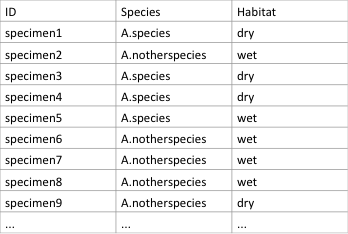

```{r eval=FALSE}
classifier <- read.csv("classifier.csv", header=T, row.names=1)
is.factor(classifier$Habitat) # check that it is a factor
[1] TRUE
classifier$Habitat
[1] dry wet dry dry wet wet wet wet dry ...
Levels: dry wet
```

Note: When reading in a data file, *R* usually treats character variables as factors, but numeric variables are not, and  therefore must be coerced into factors. See `?factor` for more information.
##	Lists
Another common data structure in *R* is a list. In essence, a list is a generic vector containing other objects. In *geomorph*, the example data are all lists. 
e.g. plethodon:
```{r comment = ""}
library(geomorph)
data(plethodon)
attributes(plethodon)
```
Here, plethodon is made up of 5 named objects (which are each vectors, matrices/2D arrays or 3D arrays). To access named objects within a list, use $, such as plethodon$links. The returned output of many *geomorph* functions is also in named list form. 
Parts of a list can also be accessed using numbers with double square brackets [[]]. So in the above example. links is the 2nd object in the plethodon list, and so can also be accessed by plethodon[[2]]. For more details on this, a good resource is the website *R* tutorial (http://www.r-tutor.com/r-introduction/list).

##	Estimating missing landmarks (`estimate.missing`)
All analysis and plotting functions in *geomorph* require a full complement of landmark coordinates. Either the missing values are estimated, or subsequent analyses are performed on a subset dataset excluding specimens with missing values. Below is the function to estimate missing data, followed by steps of how to just exclude specimens with missing values.

**Function**    
```{r eval=FALSE}
estimate.missing(A, method = c("TPS", "Reg"))
```

**Arguments**   

 * *A*	A 3D array (p x k x n) containing landmark coordinates for a set of specimens
 * *method*	Method for estimating missing landmark locations

The function estimates the locations of missing landmarks for incomplete specimens in a set of landmark configurations, where missing landmarks in the incomplete specimens are designated by NA in place of the x,y,z coordinates. Two distinct approaches are implemented.

1. The first approach (`method="TPS"`) uses the thin-plate spline to interpolate landmarks on a reference specimen to estimate the locations of missing landmarks on a target specimen. Here, a reference specimen is obtained from the set of specimens for which all landmarks are present, Next, each incomplete specimen is aligned to the reference using the set of landmarks common to both. Finally, the thin-plate spline is used to estimate the locations of the missing landmarks in the target specimen (Gunz et al. 2009).

2. The second approach (method="Reg") is multivariate regression. Here each landmark with missing values is regressed on all other landmarks for the set of complete specimens, and the missing landmark values are then predicted by this linear regression model. Because the number of variables can exceed the number of specimens, the regression is implemented on scores along the first set of PLS axes for the complete and incomplete blocks of landmarks (see Gunz et al. 2009).

One can also exploit bilateral symmetry to estimate the locations of missing landmarks. Several possibilities exist for implementing this approach (see Gunz et al. 2009). Example *R* code for one implementation is found in Claude (2008).

Missing landmarks in a target specimen are designated by NA in place of the x,y,z coordinates. To make this so:
```{r eval=FALSE}
any(is.na(mydata) # check if there are NAs in the data
FALSE # if false then,
mydata[which(mydata == -999)] <- NA # change missing values from “-999” to NAs
```
.nts files give a value in the header that is used to designate missing data (often 9999, -999 etc.). The `which(mydata == -999)` searches for these values and replaces with NA. 

To use the function, let's use an example using Plethodon dataset:
```{r eval=FALSE}
data(plethodon)
  plethland<-plethodon$land
  plethland[2,,2]<-plethland[6,,2]<-NA  # create missing landmarks
  plethland[2,,5]<-plethland[6,,5]<-NA  # create missing landmarks
  plethland[2,,10]<-NA  # create missing landmarks
new.plethland <- estimate.missing(plethland,method="TPS")
new.plethland <- estimate.missing(plethland,method="Reg")
```
The function returns a 3D array with the missing landmarks estimated. 

Instead of estimating missing, an alternative is to proceed with the specimens for which data are missing excluded. For example to make a dataset of only the complete specimens (starting with the dataset as 2D array), two ways are possible:
```{}
mydata
         [,1]     [,2]      [,3]     [,4]
 [1,]  8.893720 53.77644  9.268400 52.77072
 [2,]  8.679762 54.57819  8.935628 53.83027
 [3,]  9.805328 56.06903 NA NA
 [4,]  9.637164 58.03294  9.952104 56.77318
 [5,] NA NA 11.335110 57.85184
 [6,]  7.946625 55.71114  8.476400 54.82112
 [7,]  8.849841 58.66961  9.396387 57.82877
 [8,]  9.331504 56.36904 10.154872 55.31344
```
```{r eval=FALSE}
newdata <- mydata[complete.cases(mydata),] # keep only specimens with complete data
# OR
newdata <- na.omit(mydata) # use only specimens without NAs
```
```{}
newdata
         [,1]     [,2]      [,3]     [,4]
 [1,]  8.893720 53.77644  9.268400 52.77072
 [2,]  8.679762 54.57819  8.935628 53.83027
 [3,]  9.637164 58.03294  9.952104 56.77318
 [4,]  7.946625 55.71114  8.476400 54.82112
 [5,]  8.849841 58.66961  9.396387 57.82877
 [6,]  9.331504 56.36904 10.154872 55.31344
```

These functions can be used to make a dataset of only the landmarks in all specimens, by inputting the matrix `mydata` in transpose, e.g., `t(mydata)`. Note that these methods will re-label the specimen or landmark numbers.

## Rotate a subset of 2D landmarks to common articulation angle (fixed.angle)
A function for rotating a subset of landmarks so that the articulation angle between subsets is constant. Presently, the function is only implemented for two-dimensional landmark data.
**Function**    
```{r eval=FALSE}
fixed.angle(A, art.pt = NULL, angle.pts = NULL, rot.pts = NULL,
  			angle = 0, degrees = FALSE)
```
  			
**Arguments**    

 * *A*	A 3D array (p x k x n) containing landmark coordinates for a set of specimens  
 * *art.pt*	A number specifying which landmark is the articulation point between the two landmark subsets  
 * *angle.pts*	A vector containing numbers specifying which two points used to define the angle (one per subset)  
 * *rot.pts*	A vector containing numbers specifying which landmarks are in the subset to be rotated  
 * *angle*	An optional value specifying the additional amount by which the rotation should be augmented (in radians)  
 * *degrees*	A logical value specifying whether the additional rotation angle is expressed in degrees or radians (radians is default)  

This function standardizes the angle between two subsets of landmarks for a set of specimens. The approach assumes a simple hinge-point articulation between the two subsets, and rotates all specimens such that the angle between landmark subsets is equal across specimens (see Adams 1999). As a default, the mean angle is used, though the user may specify an additional amount by which this may be augmented.  
Example using Plethodon. Articulation point is landmark 1, rotate mandibular landmarks (2-5) relative to cranium
```{r eval=FALSE}
data(plethspecies)
new.plethdata <- fixed.angle(plethspecies$land,
                             art.pt=1,
                             angle.pts=c(5,6),
                             rot.pts=c(2,3,4,5)) 
```
Function returns a 3D array containing the newly rotated data.

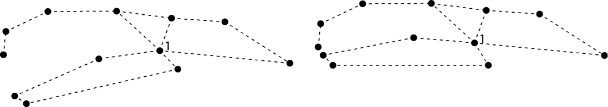
 
The position of the mandible before running fixed.angle (left) and after (right).

\pagebreak

# Generalized Procrustes Analysis
##	Generalized Procrustes Analysis (`gpagen`)
Generalized Procrustes Analysis (GPA: Gower 1975; Rohlf and Slice 1990) is the primary means by which shape variables are obtained from landmark data (for a general overview of geometric morphometrics see Bookstein 1991; Rohlf and Marcus 1993; Adams et al. 2004; Mitteroecker and Gunz 2009; Zelditch et al. 2012; Adams et al. 2013). GPA translates all specimens to the origin, scales them to unit-centroid size, and optimally rotates them (using a least-squares criterion) until the coordinates of corresponding points align as closely as possible. The resulting aligned Procrustes coordinates represent the shape of each specimen, and are found in a curved space related to Kendall's shape space (Kendall 1984). Typically, these are projected into a linear tangent space yielding Kendall's tangent space coordinates (Dryden and Mardia 1993; Rohlf 1999), which are used for subsequent multivariate analyses. Additionally, any semilandmarks on curves and are slid along their tangent directions or tangent planes during the superimposition (see Bookstein 1997; Gunz et al. 2005). Presently, two implementations are possible: 1) the locations of semilandmarks can be optimized by minimizing the bending energy between the reference and target specimen (Bookstein 1997), or by minimizing the Procrustes distance between the two (Rohlf 2010).

**The first step in any geometric morphometric analysis is to perform a Procrustes superimposition of the raw coordinate data**

**Function**    
```{r eval=FALSE}
gpagen(A, curves = NULL, surfaces = NULL, PrinAxes = TRUE, max.iter = NULL, 
       ProcD = TRUE, Proj = TRUE)
```

**Arguments**  

* *A* A 3D array (p x k x n) containing landmark coordinates for a set of specimens  
* *curves*	An optional matrix defining which landmarks should be treated as semilandmarks on boundary curves, and which landmarks specify the tangent directions for their sliding (see `define.sliders`)  
* *surfaces*	An optional vector defining which landmarks should be treated as semilandmarks on surfaces 
* *PrinAxes*	A logical value indicating whether or not to align the shape data by principal axes
* *max.iter*  The maximum number of GPA iterations to perform before superimposition is halted. The final number of iterations could be larger than this, if curves or surface semilandmarks are involved
* *ProcD*	A logical value indicating whether or not Procrustes distance should be used as the criterion for optimizing the positions of semilandmarks  
* *Proj*	A logical value indicating whether or not the aligned Procrustes residuals should be projected into tangent space

The function performs a Generalized Procrustes Analysis (GPA) on two-dimensional or three-dimensional landmark coordinates. The analysis can be performed on fixed landmark points, semilandmarks on curves, semilandmarks on surfaces, or any combination. To include semilandmarks on curves, one must specify a matrix defining which landmarks are to be treated as semilandmarks using the "curves=" option (this matrix can be made using `define.sliders`). Likewise, to include semilandmarks on surfaces, one must specify a vector listing which landmarks are to be treated as surface semilandmarks using the "surfaces=" option. The `ProcD=TRUE` option will slide the semilandmarks along their tangent directions using the Procrustes distance criterion, while `ProcD=FALSE` will slide the semilandmarks based on minimizing bending energy. The aligned Procrustes residuals can be projected into tangent space using the `Proj=TRUE` option. NOTE: Large datasets may exceed the memory limitations of *R*.

### Notes for *geomorph* 3.0
Compared to older versions of *geomorph*, users might notice subtle differences in Procrustes residuals when using semilandmarks (curves or surfaces). This difference is a result of using recursive updates of the consensus configuration with the sliding algorithms (minimized bending energy or Procrustes distances). (Previous versions used a single consensus through the sliding algorithms.) Shape differences using the recursive updates of the consensus configuration should be highly correlated with shape differences using a single consensus during the sliding algorithm, but rotational "flutter" can be expected. This should have no qualitative effect on inferential analyses using Procrustes residuals.

#### Using `plot`, `print`/`summary` on a gpagen object
The generic functions, `print`/`summary`, and `plot` all work with `gpagen`. The generic function, `plot` calls `plotAllSpecimens` and plots the aligned landmarks of all specimens with the mean. `print`/`summary` provide details of the GPA, including how many fixed and sliding semilandmarks are in the dataset, as well as how many GPA iterations it took to converge. Use `attributes` to see the elements contained in the returned list from `gpagen`.

### Procrustes Superimposition of Fixed Landmarks only
As an example, we will use the 2D landmarks of the salamander head data set saved within *geomorph*.
```{r  echo=FALSE, message = F}
library(geomorph)
data(plethodon) # example dataset
y <- gpagen(plethodon$land) # GPA-alignment 
plotRefToTarget(y$consensus,y$consensus,outline = plethodon$outline, 
                label = T, method = "points")
```
```{r}
data(plethodon) # Load the data
# See that all the specimens are in different coordinate systems
plotAllSpecimens(plethodon$land, mean=FALSE)
```
Since all of the specimens were digitized from different images, when we plot the raw data we see the specimens are all if different coordinate systems and thus are all over the place. 

To perform GPA-alignment
```{r comment = ""}
plethodon.gpa <- gpagen(plethodon$land) 
summary(plethodon.gpa)
```
Function returns a list containing the shape coordinates and centroid sizes:
```{r eval=FALSE}
plethodon.gpa$coords # a 3D array of Procrustes coordinates
plethodon.gpa$Csize # a vector of centroid sizes
```
Other important information about the GPA is stored in the `plethodon.gpa` list. Use `attributes` to see, including: *iter* The number of GPA iterations until convergence was found (or GPA halted); *points.VCV Variance-covariance matrix among landmark coordinates; *points.var* Variances of landmark points; *consnsus* The consensus (mean) configuration; akin to using `mshape`; *data* Data frame with an n x (pk) matrix of Procrustes residuals and centroid size; *Q* Final convergence criterion value; *slide.method* Method used to slide semilandmarks.

Stored in the example dataset `plethodon` are the wireframe links to aid visualisations. The function `plotAllSpecimens` plots landmark coordinates for a set of specimens:
```{r eval=FALSE}
  plotAllSpecimens(plethodon.gpa$coords,links=plethodon$links)
```
To view the options for this function
```{r eval=FALSE}
  ?plotAllSpecimens
```
            
### Procrustes Superimposition of datasets containing semilandmarks along a curve
The first example contained landmarks that are fixed, representing homologous points on the object. Oftentimes, researchers need to also use semilandmarks, which are points on a geometric feature (curve, edge, surface) defined mathematically in terms of its position on the feature (most commonly equally spaced). Semilandmarks provide information about curvature, and should be used alongside fixed landmarks. 

  
The `hummingbird` dataset, from Berns & Adams 2010, contains fixed landmarks (open circles) and semilandmarks (closed circles) that define the curvature of the beak. When semilandmarks are included in the dataset, a few extra parameters should be specified in the `gpagen` function. 

First a curve sliding matrix should be made, to tell the function which landmarks are semilandmarks and how they will slide during the superimposition. 
```{r eval=FALSE}
  data(hummingbirds) # example dataset
  hummingbirds$curvepts # an example curve sliding matrix
        before slide after
 [1,]      1    11    12
 [2,]     11    12    13
 [3,]     13    14    15
 [4,]      7    15    14
 [5,]     12    13    14
 [6,]      1    16    17
 [7,]     16    17    18
 [8,]     17    18    19
 [9,]     18    19    20
[10,]     10    20    19
[11,]      2    21    22
[12,]     21    22    23
[13,]     22    23    24
[14,]     23    24    25
[15,]      8    25    24
```

The landmarks listed in the middle column are the semilandmarks.  
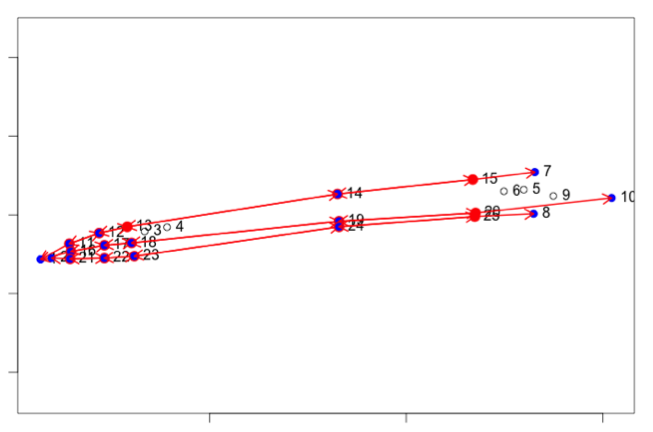  
This image is a visual version of the matrix, made using the interactive function `define.sliders` (see helper functions below).

This curve sliding matrix is used in the `gpagen` option `curves`. There are two options for how the semilandmrks will slide, using Procrustes distance or bending energy: 
```{r eval=FALSE}
# Using Procrustes Distance for sliding
A <- gpagen(hummingbirds$land,
            curves=hummingbirds$curvepts,
            ProcD=TRUE) 
# Using bending energy for sliding
B <- gpagen(hummingbirds$land,
            curves=hummingbirds$curvepts,
            ProcD=FALSE) 
```
For more information of how these two methods differ, and when to use which, see Gunz and Mitteroecker 2013 (Hystrix, <http://www.italian-journal-of-mammalogy.it/article/view/6292>).
  
### Procrustes Superimposition of datasets containing semilandmarks over a 3D surface  
As stated above, semilandmarks can also be points on a geometric feature such as a 3D surface. These data can be collected using the `buildtemplate` and `digitsurface` functions in *geomorph*.  

The example data we shall now use is `scallops`. The first specimen is plotted below, showing that there are 5 fixed landmarks (red), 11 semilandmarks along the shell edge (blue) and 30 semilandmarks over the shell surface.  

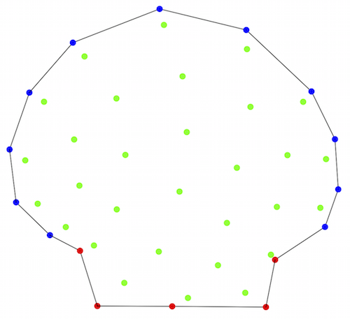

```{r eval=FALSE}
data(scallops) # dataset of scallop shells with semilandmarks
attributes(scallops) 
scallops$curvslide # the curve sliding matrix
head(scallops$surfslide) # the surfaces sliding matrix    
scallop.gpa = gpagen(A=scallops$coorddata, 
                     curves=scallops$curvslide,  
                     surfaces=scallops$surfslide) # GPA-alignment
  scallop.gpa$coords # 3D array of Procrustes coordinates
  scallop.gpa$Csize # Vector of centroid sizes
```
With 3D data, the function plots the aligned specimens in an rgl window. 

To make one these curve sliding matrices, you can use the interactive function `define.sliders` (see helper functions below).

**For all subsequent analyses, the Procrustes coordinates (i.e., Y$coords) should be used**

______
##	Generalized Procrustes Analysis with Bilateral Symmetry Analysis (`bilat.symmetry`)
If the data has bilateral symmetry, the first step is to perform a superimposition of the raw coordinate data taking into account the symmetry. This function also assesses the statistical differences in the symmetric data.

**Function**   
```{r eval=FALSE}
bilat.symmetry(A, ind = NULL, side = NULL, replicate = NULL, object.sym = FALSE, 
               land.pairs = NULL, data = NULL, iter = 999, seed = NULL, RRPP = TRUE)
```

**Arguments**   

* *A*	A 3D array (p x k x n) containing GPA-aligned coordinates for a set of specimens [for "object.sym=FALSE, A is of dimension (n x k x 2n)]  
* *ind*	A vector containing labels for each individual. For matching symmetry, the matched pairs receive the same label (replicates also receive the same label)  
* *side*	An optional vector (for matching symmetry) designating which object belongs to which 'side-group'  
* *replicate*	An optional vector designating which objects belong to which group of replicates  
* *object.sym*	A logical value specifying whether the analysis should proceed based on object `symmetry =TRUE` or matching `symmetry =FALSE`  
* *land.pairs*	An optional matrix (for object symmetry) containing numbers for matched pairs of landmarks across the line of symmetry  
* *data*  A data frame for the function environment, see `geomorph.data.frame`. It is imperative that the variables "ind", "side", and "replicate" in the data frame match these names exactly
* *iter*  Number of iterations for significance testing
* *seed*  An optional argument for setting the seed for random permutations of the resampling procedure. If left NULL (the default), the exact same P-values will be found for repeated runs of the analysis (with the same number of iterations). If seed = "random", a random seed will be used, and P-values will vary. One can also specify an integer for specific seed values, which might be of interest for advanced users
* *RRPP*  A logical value indicating whether residual randomization should be used for significance testing


The function quantifies components of shape variation for a set of specimens as described by their patterns of symmetry and asymmetry. Here, shape variation is decomposed into variation among individuals, variation among sides (directional asymmetry), and variation due to an individual x side interaction (fluctuating symmetry). These components are then statistically evaluated using Procrustes ANOVA and Goodall's F tests (i.e., an isotropic model of shape variation). Methods for both matching symmetry and object symmetry can be implemented. Matching symmetry is when each object contains mirrored pairs of structures (e.g., right and left hands) while object symmetry is when a single object is symmetric about a midline (e.g., right and left sides of human faces). Analytical and computational details concerning the analysis of symmetry in geometric morphometrics can be found in Mardia et al. (2000) and Klingenberg et al. (2002).

Analyses of symmetry for matched pairs of objects is implemented when `object.sym=FALSE`. Here, a 3D array [p x k x 2n] contains the landmark coordinates for all pairs of structures (2 structures for each of n specimens). Because the two sets of structures are on opposite sides, they represent mirror images, and one set must be reflected prior to the analysis to allow landmark correspondence. It is assumed that the user has done this prior to performing the symmetry analysis. Reflecting a set of specimens may be accomplished by multiplying one coordinate dimension by '-1' for these structures (either the x-, the y-, or the z-dimension). A vector containing information on individuals and sides must also be supplied. Replicates of each specimen may also be included in the dataset, and when specified will be used as measurement error (see Klingenberg and McIntyre 1998).

Analyses of object symmetry is implemented when `object.sym=TRUE`. Here, a 3D array [p x k x n] contains the landmark coordinates for all n specimens. To obtain information about asymmetry, the function generates a second set of objects by reflecting them about one of their coordinate axes. The landmarks across the line of symmetry are then relabeled to obtain landmark correspondence. The user must supply a list of landmark pairs. A vector containing information on individuals must also be supplied. Replicates of each specimen may also be included in the dataset, and when specified will be used as measurement error.

**Notes for geomorph 3.0**

Compared to older versions of *geomorph*, some results can be expected to be slightly different. Starting with *geomorph* 3.0, results use only type I sums of squares (SS) with either full randomization of raw shape values or RRPP (preferred with nested terms) for analysis of variance (ANOVA). Older versions used a combination of parametric and non-parametric results, as well as a combination of type I and type III SS. While analytical conclusions should be consistent (i.e., "significance" of effects is the same), these updates maintain consistency in analytical philosophy. This change will require longer computation time for large datasets, but the trade-off allows users to have more flexibility and eliminates combining disparate analytical philosophies.

Note also that significance of terms in the model are found by comparing F-values for each term to those obtained via permutation. F-ratios and df are not strictly necessary (a ratio of SS would suffice), but they are reported as is standard for anova tables. Additionally, users will notice that the df reported are based on the number of observations rather than a combination of objects * coordinates * dimensions, as is sometimes found in morphometric studies of symmetry. However, this change has no effect on hypothesis testing, as only SS vary among permutations (df, coordinates, and dimensions are constants).

### Example of matching symmetry
```{r comment = ""}
data(mosquito)
gdf <- geomorph.data.frame(wingshape = mosquito$wingshape, 
      ind=mosquito$ind, side=mosquito$side,
      replicate=mosquito$replicate) # make geomorph.data.frame
mosquito.sym <- bilat.symmetry(A = wingshape, ind = ind, side = side,
                replicate = replicate, object.sym = FALSE, RRPP = TRUE, 
                iter = 499, data = gdf) # perform matching symmetry GPA
summary(mosquito.sym)
```
Function returns the ANOVA table for analysis of symmetry and a graph showing the shape deformations relating to the symmetric and asymmetric components of shape. When `verbose=TRUE`, the function returns the symmetric component of shape variation (`$symm.shape`) and the asymmetric component of shape variation (`$asymm.shape`), to be used in subsequent analyses like Procrustes coordinates.

### Example of object symmetry
```{r comment = ""}
data(scallops)
gdf <- geomorph.data.frame(shape = scallops$coorddata, ind=scallops$ind)
scallop.sym <- bilat.symmetry(A = shape, ind = ind, object.sym = TRUE, 
               land.pairs=scallops$land.pairs, data = gdf, RRPP = TRUE, 
               iter = 499) # perform object symmetry GPA
summary(scallop.sym)
```

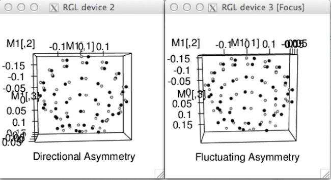


******

## Helper functions

###	Define sliding semilandmarks (`define.sliders`)
An interactive function to define which landmarks will "slide" along curves. 

**Function**  
```{r eval=FALSE}
define.sliders(spec, nsliders, surfsliders = FALSE)
```

**Arguments**  

 * *spec*	Name of specimen, as an object matrix containing 2D or 3D landmark coordinates
 * *nsliders*	Number of landmarks to be semilandmarks that slide along curves
 * *surfsliders* Logical (3D only) If 'spec' contains landmarks that are "surface sliders", made by `buildtemplate`, "surfslide.csv" should be in working directory

Function takes a matrix of digitized landmark coordinates and helps user choose which landmarks will be treated as "curve sliders" in Generalized Procrustes analysis `gpagen`. This type of semilandmark "slides" along curves lacking known landmarks (see Bookstein 1997 for algorithm details). Each sliding semilandmark ("sliders") will slide between two designated points, along a line tangent to the specified curvature.

#### Selection in 2D
Choosing which landmarks will be sliders involves landmark selection using a mouse in the plot window. To define the sliders, for each sliding landmark along the curve in the format 'before-slider-after', using the LEFT mouse button (or regular button for Mac users), click on the hollow circle to choose the landmark in the following order:
1)  Click to choose the first landmark between which semi-landmark will "slide",
2)  Click to choose sliding landmark,
3)  Click to choose the last landmark between which semi-landmark will "slide". Selected landmarks will be filled in and lines are drawn connecting the three landmarks, and will highlight the sliding semilandmark in red and the flanking landmarks in blue.
```{r eval=FALSE}
data(hummingbirds)
define.sliders(hummingbirds$land[,,1], nsliders=10)
```

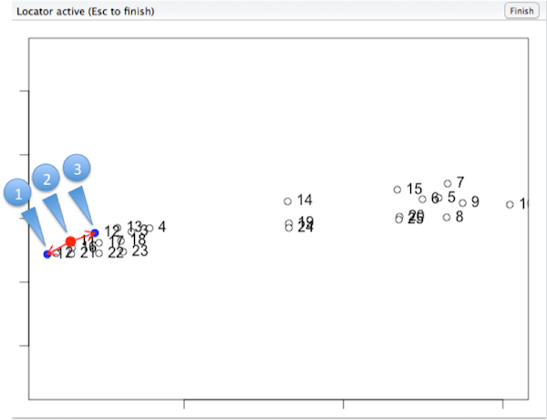 


When complete,

  


#### Selection in 3D
To define the sliders, for each sliding landmark along the curve in the format 'before-slider-after', using RIGHT mouse button to select:
1) Click on landmark to choose the first landmark between which semi-landmark will "slide",
2) Click box to choose sliding landmark,
3) Click box to choose the last landmark between which semi-landmark will "slide", Screen will show lines connecting the three landmarks, and will highlight the sliding semilandmark in red.

Here we will run it using the first specimen of the scallop example dataset 
```{r eval=FALSE}
data(scallops)
define.sliders(scallops$coorddata[,,1], 
               nsliders=11, 
               surfsliders = scallops$surfslide) # Interactive function in rgl window
```
The way this function works is to select the landmarks in a "before" "slide" "after" pattern, so defining between which landmarks the semilandmark will slide:


 


Left: In action. Right: Finished. And in the console will be printed:
```{}
semi-landmark 16 slides between landmarks 1 and 15 
semi-landmark 15 slides between landmarks 16 and 14 
semi-landmark 14 slides between landmarks 15 and 13 
semi-landmark 13 slides between landmarks 14 and 12 
semi-landmark 12 slides between landmarks 13 and 11 
semi-landmark 11 slides between landmarks 12 and 10 
semi-landmark 10 slides between landmarks 11 and 9 
semi-landmark 9 slides between landmarks 10 and 8 
semi-landmark 8 slides between landmarks 9 and 7 
semi-landmark 7 slides between landmarks 8 and 6 
semi-landmark 6 slides between landmarks 7 and 5 
```

This procedure is overlapping, so for example a curve defined by a sequence of semilandmarks, the user must select the 2nd point of the first three to be the 1st for the next e.g., 1 2 3 then 2 3 4, etc.
Function returns a 'curves x 3' matrix containing the landmark address of the curve sliders, indicating the points between which the selected point will "slide", written to the working directory as "curveslide.csv". 

*curveslide.csv*
```
before	slide	after
15	16	1
16	15	14
15  14  13
14  13  12
13  12  11
12  11  10
11  10  9
10  9   8
9   8   7
8   7   6
7   6   5
```
which can be read in for use with `gpagen`: 
```{r eval=FALSE}
curves <- as.matrix(read.csv("curveslide.csv", header=T))
# as.matrix is necessary here to ascertain numeric
```

\pagebreak

# Data Analysis
After the data have been superimposed with `gpagen` or `bilat.symmetry`, the Procrustes coordinates (e.g., `$coords` in the gpagen out list) can be used in many ordination methods and visualization methods.


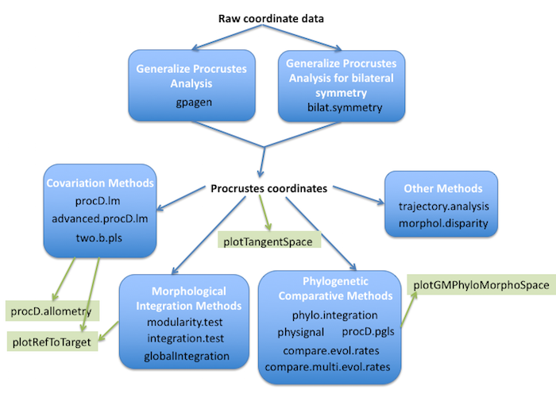 

Overview of some of the analysis (blue) and visualization (green) functions in *geomorph*. 

The next 4 chapters will cover *geomorph's* analytical functions, organized as follows (hyperlinks): [covariation methods](#covariation-methods), 
[morphological integration methods](#morphological-integration-methods), [phylogenetic comparative methods](#phylogenetic-comparative-methods), [other specialist methods](#other-methods). Ordination methods and visualization methods accompanying these analyses are in chapters 9-13.

**For all of the following functions it is assumed that the landmarks have previously been aligned using Generalized Procrustes Analysis (GPA)**. 

NOTE: The analytical functions presented here are for the analysis of multivariate data; most commonly this is Procrustes shape variables, but can also be used with non-shape, morphometric data (e.g. a set of iterlandmark distances, a.k.a. linear measurements) or any set of continuous variables. 

Presented here is an extended version what is provided in the manual pages - it is recommend to read the manual page for the function by typing ?function.name in the console to see the most up-to-date info about the function. Many functions return information in the form of a list, therefore we recommend users save the results to an object as follows:
```{r eval=F}
res <- procD.lm(shape ~ size)
```
From version 3.0, almost all analytical functions work with the generic functions, `print`/`summary`, and `plot`. Thus following from the above example, using `plot(res)` will return a plot for that function (see ?plot.function.name for more options), and `print(res)` or `summary(res)` will print into the console the results of the analytical function. Other objects retu3rned in the `res` list might be useful for further analyses; see the specific function's manual page for more details. 

------

# Covariation methods
The following methods allow the user to test for relationship between shape and other factors.

## Procrustes ANOVA/regression for shape data (`procD.lm`)
Function performs Procrustes ANOVA with permutation procedures to assess statistical hypotheses describing patterns of shape variation and covariation for a set of Procrustes-aligned coordinates. To see the manual page for this function, type `?geomorph::procD.lm`.

**Function**  
```{r eval=F}
`procD.lm(f1, iter = 999, seed = NULL, RRPP = TRUE, 
          int.first = FALSE, data = NULL, ...)
```

**Arguments**

 * *f1* A formula for the linear model (e.g., y~x1+x2)
 * *iter* Number of iterations for significance testing
 * *seed* An optional argument for setting the seed for random permutations of the resampling procedure.
If left NULL (the default), the exact same P-values will be found for repeated runs of the analysis (with the same number of iterations).
If seed = "random", a random seed will be used, and P-values will vary.  One can also specify an integer for specific seed values,
which might be of interest for advanced users.
 * *RRPP* A logical value indicating whether residual randomization should be used for significance testing (see Introduction VI.	Permutation tests)
 * *int.first* A logical value to indicate if interactions of first main effects should precede subsequent main effects}
 * *data* A data frame for the function environment, see `geomorph.data.frame`
 * *...* Arguments passed on to procD.fit (typically associated with the `lm` function)
  
### Common uses of this function
This function requires an expression of the form y ~ model, interpreted as a specification that the response y is modeled by a linear predictor specified symbolically by model.  

y is usually the shape coordinates (from `gpagen`). The other terms (x) can be continuous (e.g. centroid size) or discrete (categorical variable, e.g. sex). Some common models and questions: 

 * Simple Multivariate Regression: `y ~ x`, e.g., Does shape correlate with size (x)?
 * Single-factor MANOVA: `y ~ a`, e.g.,  Does shape differ between sexes (a)?
 * Single-factor MANCOVA: `y ~ x * a` [means `a + x + a:x`, where : denotes interaction], e.g., Does shape differ between sexes (a), while accounting for shape covarying with size (x)?
 * Multiple-factor MANOVA: `y ~ a + b`, e.g., Does shape differ between sexes as well as localities (b)?
 * Factorial MANOVA: `y ~ a * b`  [means `a + b + a:b`, where : denotes interaction],e.g., Does shape differ between sexes and localities, accounting for the possibility that the two factors may interact (one sex more likely found in a particular locality)
 * Nested MANOVA: `y ~ a / b`, a hierarchical model, where b is nested within a. e.g., replicates (b) of treatments (a).

NOTE: This function can also be used with non-shape, multivariate data in y (e.g. a set of iterlandmark distances, a.k.a. linear measurements). 

**Returned information**
The function returns a lot of information. In addition to using plot or summary on the returned object, the following may be useful for further analysis:
 * *residuals* The residuals (observed responses - fitted responses).

### Helper function: `nested.update`
If one has performed a nested model with `procD.lm`, then the function `nested.update` is needed to adjust models. Type `?nested.update` for details.

**Example**
MANOVA example for Goodall's F test (multivariate shape vs. factors)
```{r  echo=FALSE, message = FALSE}
library(geomorph)
```
```{r comment=""}
data(plethodon) # example dataset
Y.gpa <- gpagen(plethodon$land)    # GPA-alignment  
gdf <- geomorph.data.frame(shape = Y.gpa$coords, 
site = plethodon$site, species = plethodon$species) # make geomorph data frame

# permutation option 1: randomize raw values
procD.lm(shape ~ species * site, data = gdf, iter = 999, RRPP = FALSE)
# permutation option 1: randomize residuals
procD.lm(shape ~ species * site, data = gdf, iter = 999, RRPP = TRUE) 
```

## Advanced Procrustes ANOVA and pairwise tests for shape data, using complex linear models (`advanced.procD.lm`)
Function is an advanced version of `procD.lm`, which quantifies the relative amount of shape variation explained by a suite of factors and covariates in a "full" model, after accounting for variation in a "reduced" model. Inputs are formulae for full and reduced models (order is not important, but it is better to list the model with the most terms first or use a *geomorph* data frame), plus indication if means or slopes are to be compared among groups, with appropriate formulae to define how they should be compared. To see the manual page for this function, type `?geomorph::advanced.procD.lm`. (This function replaces the now defunct pairiwseD.test and pairiwse.slope.test).

**Function**  
```{r eval=FALSE}
advanced.procD.lm(f1, f2, groups = NULL, slope = NULL, 
  angle.type = c("r","deg", "rad"), phy = NULL, pc.shape = FALSE, 
  iter = 999, seed = NULL, data = NULL, ...)
```

**Arguments**  

 * *f1* A formula for the linear model (e.g., y~x1+x2)
 * *f2* A formula for another linear model (e.g., ~ x1 + x2 + x3 + a*b). f1 and f2 should be nested.
 * *groups*	 A formula for grouping factors (e.g., ~ a, or ~ a*b)
 * *slope* A formula with one covariate (e.g., ~ x3)
 * *angle.type* A value specifying whether differences between slopes should be represented by vector correlations (r), radians (rad) or degrees (deg)
 * *phy* A phylogenetic tree of class phylo - see `?ape::read.tree` (optional)
 * *pc.shape* An argument for whether analysis should be performed on the principal component scores of shape. This is a useful option if the data are high-dimensional (many more variables that observations) but will not affect results
 * *iter* Number of iterations for significance testing
 * *seed* An optional argument for setting the seed for random permutations of the resampling procedure.
If left NULL (the default), the exact same P-values will be found for repeated runs of the analysis (with the same number of iterations).
If seed = "random", a random seed will be used, and P-values will vary.  One can also specify an integer for specific seed values,
which might be of interest for advanced users.
 * *data* A data frame for the function environment, see `geomorph.data.frame`
 * *...* Arguments passed on to `procD.fit` (typically associated with the `lm` function)
 
 NOTE: This function can also be used with non-shape, multivariate data in y (e.g. a set of iterlandmark distances, a.k.a. linear measurements). 

For more information on how to use this function see: http://geomorphpackage.blogspot.com.au/2015/06/advancedprocdlm-for-pairwise-tests-and.html

**Example**  
Test of homogeneity of slopes, plus pairwise slopes comparisons
```{r comment=""}
data(plethodon) # example dataset
Y.gpa <- gpagen(plethodon$land)    # GPA-alignment  
gdf <- geomorph.data.frame(shape = Y.gpa$coords, logcs = log(Y.gpa$Csize), 
site = plethodon$site, species = plethodon$species) # make geomorph data frame

advanced.procD.lm(shape ~ logcs, ~logcs + site*species, 
groups = ~site*species, slope = ~logcs, angle.type = "deg", 
iter = 199, data = gdf)
```

## Procrustes ANOVA/regression, specifically for shape-size covariation (allometry) (`procD.allometry`)
Function performs Procrustes ANOVA with permutation procedures to assess statistical hypotheses describing patterns of shape covariation with size for a set of Procrustes-aligned coordinates. Other factors or covariates can also be included in the analysis. This function also provides results for plotting allometric curves.

**Function**    
```{r eval=FALSE}
procD.allometry(f1, f2 = NULL, f3 = NULL, logsz = TRUE, iter = 999,
  seed = NULL, alpha = 0.05, RRPP = TRUE, data = NULL, ...)
```

**Arguments**   

 * *f1* A formula for the relationship of shape and size; e.g., Y ~ X
 * *f2* An optional right-hand formula for the inclusion of groups; e.g., ~ groups
 * *f3*	 A optional right-hand formula for the inclusion of additional variables; e.g., ~ a + b + c + ...
 * *logsz* A logical argument to indicate if the variable for size should be log-transformed
 * *iter* Number of iterations for significance testing
 * *seed* An optional argument for setting the seed for random permutations of the resampling procedure.
If left NULL (the default), the exact same P-values will be found for repeated runs of the analysis (with the same number of iterations).
If seed = "random", a random seed will be used, and P-values will vary.  One can also specify an integer for specific seed values,
which might be of interest for advanced users
 * *alpha* The significance level for the homegeneity of slopes test
 * *RRPP* A logical value indicating whether residual randomization should be used for significance testing (see Introduction VI.	Permutation tests)
 * *data* A data frame for the function environment, see `geomorph.data.frame`
 * *...* Arguments passed on to `procD.fit` (typically associated with the `lm` function)
 
**Details**  
The function quantifies the relative amount of shape variation attributable to covariation with organism size (allometry) plus other factors in a linear model, plus estimates the probability of this variation ("significance") for a null model, via distributions generated from resampling permutations. Data input is specified by formulae (e.g., Y ~ X), where 'Y' specifies the response variables (shape data), and 'X' contains one or more independent variables (discrete or continuous). The response matrix 'Y' can be either in the form of a two-dimensional data matrix of dimension (n x [p x k]), or a 3D array (p x n x k). It is assumed that -if the data are based on landmark coordinates - the landmarks have previously been aligned using Generalized Procrustes Analysis (GPA) [e.g., with gpagen].

There are three formulae that need to be input (see Arguments). The first must contain variables for shape and size, e.g., Y ~ X, where Y (dependent variable) is shape and X (independent variable) is size. The other two formulae are optional to indicate (1) groups for separate allometric curves and (2) additional model variables to consider in the ANOVA. The groups input must be a single factor or multiple factors. The resulting ANOVA uses sequential (Type I) sums of squares and cross-products with variables in this order: size, groups (if provided), size*groups (if warranted), other variables (if provided). If a factor for f2 (groups) is provided, ANOVA for a "homogeneity of slopes" test will also be performed.
 
**Example**  
Simple allometry
```{r comment=""}
data(plethodon) # example dataset
Y.gpa <- gpagen(plethodon$land)    # GPA-alignment  
# make geomorph data frame
gdf <- geomorph.data.frame(shape = Y.gpa$coords, cs = Y.gpa$Csize) 

plethAllometry <- procD.allometry(shape~cs, logsz = TRUE, data=gdf, iter=499)
summary(plethAllometry) # results identical to procD.lm
```

Obtaining size-adjusted residuals (and allometry-free shapes)
```{r comment=""}
plethAnova <- procD.lm(plethAllometry$formula,
     data = plethAllometry$data, iter = 499, RRPP=TRUE) 
summary(plethAnova) # same ANOVA Table
# save size-adjusted residuals an make as 3D array
shape.resid <- arrayspecs(plethAnova$residuals,
   p=dim(Y.gpa$coords)[1], k=dim(Y.gpa$coords)[2]) # size-adjusted residuals
# make allometry-free shapes
adj.shape <- shape.resid + array(Y.gpa$consensus, dim(shape.resid)) 
plotTangentSpace(adj.shape) # PCA of allometry-free shape
```

Comparing allometric slopes between groups (Homogeneity of Slopes Test)
```{r comment=""}
data(plethodon) # example dataset
Y.gpa <- gpagen(plethodon$land)    # GPA-alignment
# make geomorph data frame
gdf <- geomorph.data.frame(shape = Y.gpa$coords, cs = Y.gpa$Csize, 
                           site = plethodon$site, species = plethodon$species) 
plethAllometry <- procD.allometry(shape~cs, ~species*site,
logsz = TRUE, data=gdf, iter=499, RRPP=TRUE)
summary(plethAllometry)
plot(plethAllometry, method = "PredLine")
```

## Two-block partial least squares analysis for shape data (`two.b.pls`)
Function performs two-block partial least squares analysis to assess the degree of association between to blocks of Procrustes-aligned coordinates (or other variables) (see Rohlf and Corti 2000). To see the manual page for this function, type `?geomorph::two.b.pls`.

**Function**    
```{r eval=FALSE}
two.b.pls(A1, A2, iter = 999, seed = NULL)
```

**Arguments**    

 * *A1* A 3D array (p x k x n) containing GPA-aligned coordinates, or a matrix (n x variables), for the first block
 * *A2* A 3D array (p x k x n) containing GPA-aligned coordinates, or a matrix (n x variables), for the second block
 * *iter* Number of iterations for significance testing
 * *seed* An optional argument for setting the seed for random permutations of the resampling procedure.
If left NULL (the default), the exact same P-values will be found for repeated runs of the analysis (with the same number of iterations).
If seed = "random", a random seed will be used, and P-values will vary.  One can also specify an integer for specific seed values,
which might be of interest for advanced users.

NOTE: This function can also be used with non-shape, multivariate data in A1 or A2 (e.g. a set of iterlandmark distances, a.k.a. linear measurements, or ecological variables). 

**Example**  
2B-PLS between plethodon head shape and food use data
```{r comment=""}
data(plethShapeFood) # example dataset 
Y.gpa<-gpagen(plethShapeFood$land)    # GPA-alignment    
PLS <-two.b.pls(Y.gpa$coords,plethShapeFood$food,iter=999)
summary(PLS) # Test summary
plot(PLS) # PLS plot
```

------
# Morphological Integration methods
Morphological integration is the tendancy of morphological traits to vary in a coordinated manner, and usually studied through testing the strength of covariation between two or more sets of traits. The related concept, modularity, is when an orgnaism's structure is compartmentalized, and can be analyzed in a variety of ways. *geomorph* presents a few of the recent methods in studing morphological integration and modularity in high-dimensional data. Suggested reading on the subject: Klingenberg 2008, Klingenberg 2014, Mitteroecker & Bookstein 2007 and references therein. 

## Quantify morphological integration between two modules (`integration.test`)
Function quantifies the degree of morphological integration between modules of Procrustes-aligned coordinates, using a two-block partial least squares analysis (PLS). To see the manual page for this function, type `?geomorph::integration.test`. (Formerly known as `morphol.integr`).

**Function**    
```{r eval=FALSE}
integration.test(A, A2 = NULL, partition.gp = NULL, iter = 999, seed = NULL)
```

**Arguments**   

 * *A* A 3D array (p x k x n) containing GPA-aligned coordinates of all specimens, or a matrix (n x variables)
 * *A2* Optional 3D array containing GPA-aligned coordinates, or 2D matrix, for the second partition
 * *partition.gp* A vector describing which landmarks (or variables) belong in which partition (e.g. A,A,A,B,B,B,C,C,C) (required when only A is provided)
 * *iter* Number of iterations for significance testing
 * *seed* An optional argument for setting the seed for random permutations of the resampling procedure.
If left NULL (the default), the exact same P-values will be found for repeated runs of the analysis (with the same number of iterations).
If seed = "random", a random seed will be used, and P-values will vary.  One can also specify an integer for specific seed values,
which might be of interest for advanced users.

**Example**  
Test for morphological integration between plethodon skull and mandible shape
```{r comment=""}
data(plethodon) # example dataset
Y.gpa<-gpagen(plethodon$land)    # GPA-alignment    
# landmarks on the skull and mandible assigned to partitions B and A reseptively
land.gps<-c("A","A","A","A","A","B","B","B","B","B","B","B") 
IT <- integration.test(Y.gpa$coords, partition.gp=land.gps, iter=999)
summary(IT) # Test summary
plot(IT) # PLS plot
```

## Compare modular signal to alternative landmark subsets (`modularity.test`)
Function quantifies the degree of modularity between two or more hypothesized modules of Procrustes-aligned landmark coordinates and compares this to patterns found by randomly assigning landmarks into subsets (Adams 2016). To see the manual page for this function, type `?geomorph::modularity.test`. (Formerly known as `compare.modular.partitions`).

**Function**    
```{r eval=FALSE}
modularity.test(A, partition.gp, iter = 999, CI = FALSE, seed = NULL)
```

**Arguments**  

 * *A* A 3D array (p x k x n) containing GPA-aligned coordinates of all specimens, or a matrix (n x variables)
 * *partition.gp* A vector describing which landmarks (or variables) belong in which partition (e.g. A,A,A,B,B,B,C,C,C)
 * *iter* Number of iterations for significance testing
 * *CI* A logical argument indicating whether bootstrapping should be used for estimating confidence intervals
 * *seed* An optional argument for setting the seed for random permutations of the resampling procedure.
If left NULL (the default), the exact same P-values will be found for repeated runs of the analysis (with the same number of iterations). If seed = "random", a random seed will be used, and P-values will vary.  One can also specify an integer for specific seed values, which might be of interest for advanced users.

**Example**  
Test for morphological integration between plethodon skull and mandible shape
```{r comment=""}
data(pupfish) # example dataset
Y.gpa<-gpagen(pupfish$coords)    # GPA-alignment    
# Define landmarks on the body (a) and operculum (b)
land.gps<-rep('a',56); land.gps[39:48]<-'b'
MT <- modularity.test(Y.gpa$coords,land.gps,CI=FALSE,iter=499)
summary(MT) # Test summary
plot(MT) # Histogram of CR sampling distribution 
```

### Helper function: `define.modules`
Function takes a matrix of digitized landmark coordinates and allows user assign landmarks to each module. The output is a list of which landmarks belong in which partition, to be used by `modularity.test` of `integration.test` option *partition.gp*. 

**Function**    
```{r eval=FALSE}
define.modules(spec, nmodules)
```
**Arguments**   

 * *spec*	A p x k matrix containing landmark coordinates of a single specimen (2D or 3D)
 * *nmodules*	Number of modules to be defined

#### Selection in 2D
Choosing which landmarks will be included in each module involves landmark selection using a mouse in the plot window. The user is prompted to select each landmark in turn to be assigned to module 1: using the LEFT mouse button (or regular button for Mac users), click on the hollow circle to choose the landmark. Selected landmarks will be filled in. When all landmarks for module 1 are chosen, press 'esc', and then start selecting landmarks for module 2. Repeat until all modules are defined.

#### Selection in 3D
Choosing which landmarks will be included in each module involves landmark selection using a mouse in the rgl plot window. The user is prompted to select one or more landmarks. To do so, use the RIGHT mouse button (or command + LEFT button for Mac users), draw a rectangle around one or more landmarks to select. Selected landmarks will be colored yellow. Then type into the console a letter (e.g. 1, 2, 3...) to assign selected landmark(s) to this module. Repeat until all landmarks are assigned to modules.

```{r eval=F}
# using first specimen of plethodon dataset
partition.gp <- define.modules(plethodon$land[,,1], 2) 
Select landmarks in module 1
Press esc when finished 
```

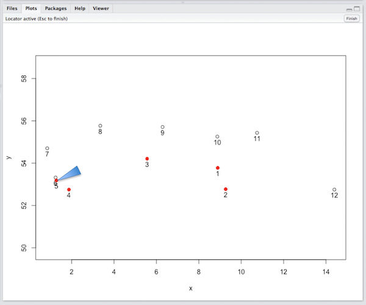

```{r eval=F}
Select landmarks in module 2
Press esc when finished 
```

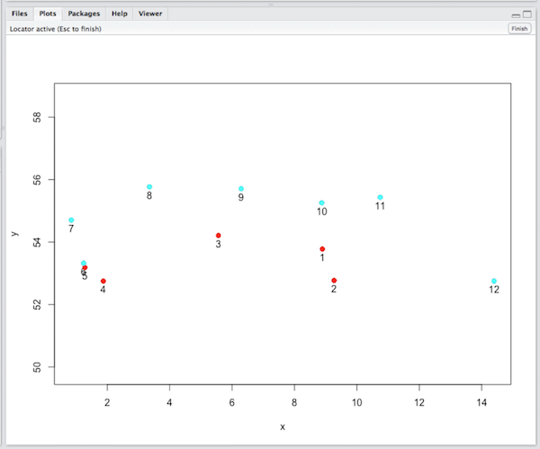

```{r eval=F}
partition.gp
 [1] "1" "1" "1" "1" "1" "2" "2" "2" "2" "2" "2" "2"
```

------
# Phylogenetic Comparative methods
The following methods allow users to take phylogenetic non-independence into account during the analysis of multivariate datasets.

All of these functions require a phylogenetic tree of class phylo - see `?ape::read.tree` (optional). The tree must have number of tips equal to number of taxa in the data matrix (e.g., `?ape::drop.tip`). And, tip labels of the tree MUST be exactly the same as the taxa names in the landmark data matrix (check using `match`). To learn more about phylogenetic trees in *R*, look at these resources: http://www.r-phylo.org/wiki/ and http://bodegaphylo.wikispot.org/Phylogenetics_and_Comparative_Methods_in_R

## Assessing phylogenetic signal in morphometric data (`physignal`)
Function calculates the degree of phylogenetic signal from a set of Procrustes-aligned specimens. The degree of phylogenetic signal in data is estimated using the multivariate version of the K-statistic (Kmult: Adams 2014). This value evaluates the degree of phylogenetic signal in a dataset relative to what is expected under a Brownian motion model of evolution. For geometric morphometric data, the approach is a mathematical generalization of the Kappa statistic (Blomberg et al. 2003) appropriate for highly multivariate data (see Adams 2014). Significance testing is found by permuting the shape data among the tips of the phylogeny. Note that this method can be quite slow as ancestral states must be estimated for every iteration. To see the manual page for this function, type `?geomorph::physignal`. 

**Function**    
```{r eval=FALSE}
physignal(A, phy, iter = 999, seed = NULL)
```

**Arguments**  

 * *A* A 3D array (p x k x n) containing GPA-aligned coordinates of all specimens, or a matrix (n x variables)
 * *phy* A phylogenetic tree of class phylo - see `?ape::read.tree` (optional)
 * *iter* Number of iterations for significance testing
 * *seed* An optional argument for setting the seed for random permutations of the resampling procedure.
If left NULL (the default), the exact same P-values will be found for repeated runs of the analysis (with the same number of iterations).
If seed = "random", a random seed will be used, and P-values will vary.  One can also specify an integer for specific seed values,
which might be of interest for advanced users.

**Example**  
Test for phylogenetic signal in plethodon head shape
```{r comment=""}
data(plethspecies) # example dataset
Y.gpa<-gpagen(plethspecies$land)    # GPA-alignment    
PS.shape <- physignal(A=Y.gpa$coords,phy=plethspecies$phy,iter=999)
summary(PS.shape) # Test summary
plot(PS.shape) # Histogram
```
Test for phylogenetic signal in plethodon head size
```{r comment=""}
PS.size <- physignal(A=Y.gpa$Csize,phy=plethspecies$phy,iter=999)
summary(PS.size) # Test summary
plot(PS.size) # Histogram
```

## Quantify phylogenetic morphological integration between two sets of variables (`phylo.integration`)	
Function quantifies the degree of phylogenetic morphological covariation between two or more sets of Procrustes-aligned coordinates using partial least squares. The degree of morphological covariation is estimated between two or sets of variables while accounting for phylogeny using partial least squares (Adams and Felice 2014), and under a Brownian motion model of evolution. If more than two partitions are defined, the average pairwise PLS correlation is utilized as the test statistic. The observed value is statistically assessed using permutation, where data for one partition are permuted relative to the other partitions. Note that this permutation is performed on phylogenetically- transformed data, so that the probability of phylogenetic association of A vs. B is similar to that of B vs. A: i.e., prob(A,B|phy)~prob(B,A|phy). (Formerly known as `phylo.pls`). To see the manual page for this function, type `?geomorph::phylo.integration`. 

**Function**    
```{r eval=FALSE}
phylo.integration(A, A2 = NULL, phy, partition.gp = NULL, iter = 999,
  seed = NULL)
```

**Arguments**    

 * *A* A 3D array (p x k x n) containing GPA-aligned coordinates of all specimens, or a matrix (n x variables)
 * *A2* Optional 3D array containing GPA-aligned coordinates, or 2D matrix, for the second partition
 * *phy* A phylogenetic tree of class phylo - see `?ape::read.tree` (optional)
 * *partition.gp* A vector describing which landmarks (or variables) belong in which partition (e.g. A,A,A,B,B,B,C,C,C) (required when only A is provided)
 * *iter* Number of iterations for significance testing
 * *seed* An optional argument for setting the seed for random permutations of the resampling procedure.
If left NULL (the default), the exact same P-values will be found for repeated runs of the analysis (with the same number of iterations).
If seed = "random", a random seed will be used, and P-values will vary.  One can also specify an integer for specific seed values,
which might be of interest for advanced users.

**Example**  
Test for phylogentic morphological integration between plethodon cranium and mandible shape
```{r comment=""}
data(plethspecies) # example dataset
Y.gpa<-gpagen(plethspecies$land)    # GPA-alignment    
# landmarks on the skull and mandible assigned to partitions B and A reseptively
land.gps<-c("A","A","A","A","A","B","B","B","B","B","B")
IT<- phylo.integration(Y.gpa$coords,partition.gp=land.gps,
                       phy=plethspecies$phy,iter=999)
summary(IT) # Test summary
plot(IT) # PLS plot
```


## Comparing rates of shape evolution on phylogenies (`compare.evol.rates`)
Function calculates rates of shape evolution for two or more groups of species on a phylogeny from a set of Procrustes-aligned specimens, under a Brownian motion model of evolution. The approach is based on the distances between species in morphospace after phylogenetic transformation (Adams 2014). From the data the rate of shape evolution for each group is calculated, and a ratio of rates is obtained. If three or more groups of species are used, the ratio of the maximum to minimum rate is used as a test statistic (see Adams 2014). Significance testing is accomplished by phylogenetic simulation in which tips data are obtained under Brownian motion using a common evolutionary rate pattern for all species on the phylogeny. Specifically, the common evolutionary rate matrix for all species is used, with the multi-dimensional rate used along the diagonal elements (see Denton and Adams 2015). This procedure is more general than the original simulation procedure, and retains the desirable statistical properties of earlier methods, and under a wider array of data types. If three or more groups of species are used, pairwise p-values are also calculated. The function can be used to obtain a rate for the whole dataset of species by using a dummy group factor assigning all species to one group. To see the manual page for this function, type `?geomorph::compare.evol.rates`. 

**Function**    
```{r eval=FALSE}
compare.evol.rates(A, phy, gp, iter = 999)
```

**Arguments** 

 * *A* A 3D array (p x k x n) containing GPA-aligned coordinates of all specimens, or a matrix (n x variables)
 * *phy* A phylogenetic tree of class phylo - see `?ape::read.tree` (optional)
 * *gp* A factor describing group membership
 * *iter* Number of iterations for significance testing
 
**Example**  
Test for phylogentic morphological integration between plethodon cranium and mandible shape
```{r comment=""}
data(plethspecies) # example dataset
Y.gpa<-gpagen(plethspecies$land)    # GPA-alignment    
# group factor endangered species vs. rest
gp.end<-factor(c(0,0,1,0,0,1,1,0,0))  
 names(gp.end)<-plethspecies$phy$tip
ER<-compare.evol.rates(A=Y.gpa$coords, phy=plethspecies$phy,gp=gp.end,iter=999)
summary(ER) # Test summary
plot(ER) # Histogram
```

## Comparing rates of shape evolution among traits on phylogenies (`compare.multi.evol.rates`)
Function compares rates of morphological evolution for two or more multi-dimensional traits on a phylogeny, under a Brownian motion model of evolution following the procedure of Denton and Adams (2015). The approach calculates multivariate evolutionary rates found from the distances between species in morphospace after phylogenetic transformation (sensu Adams 2014). From the data the rate of shape evolution for each multi-dimensional trait is calculated, and a ratio of rates is obtained. If three or more traits are used, the ratio of the maximum to minimum rate is used as a test statistic (see Denton and Adams 2015). Significance testing is accomplished by phylogenetic simulation in which tips data are obtained under Brownian motion using a an evolutionary rate matrix for all traits, which contains a common rate for all trait dimensions (Denton and Adams 2015). If three or more traits are used, pairwise p-values are also returned. To see the manual page for this function, type `?geomorph::compare.multi.evol.rates`. 

**Function**    
```{r eval=FALSE}
compare.multi.evol.rates(A, gp, phy, Subset = TRUE, iter = 999)
```

**Arguments**  

 * *A* A 3D array (p x k x n) containing GPA-aligned coordinates of all specimens, or a matrix (n x variables)
 * *gp* A factor describing group membership
 * *phy* A phylogenetic tree of class phylo - see `?ape::read.tree` (optional)
 * *Subset* A logical value indicating whether or not the traits are subsets from a single landmark configuration (default is TRUE)
 * *iter* Number of iterations for significance testing
 
Comparisons of evolutionary rates between traits may be accomplished in one of two ways. First, if the traits are are part of a single shape that was subjected to a single Procrustes superimposition (i.e., they are subsets of landmarks in the configuration), then the procedure is performed without alteration as described above (`Subset = TRUE`). However, if the shapes are derived from different structures (shapes) that were superimposed separately, then the estimates of the rates must take the difference in the number of trait dimensions into account (see discussion in Denton and Adams 2015). This option is identified by selecting `Subset = FALSE`.
 
**Example**  
Test for phylogentic morphological integration between plethodon cranium and mandible shape
```{r comment=""}
data(plethspecies) # example dataset
Y.gpa<-gpagen(plethspecies$land)    # GPA-alignment    
# landmarks on the skull and mandible assigned to partitions B and A reseptively
land.gps<-c("A","A","A","A","A","B","B","B","B","B","B")
EMR<-compare.multi.evol.rates(A=Y.gpa$coords,gp=land.gps, 
    Subset=TRUE, phy= plethspecies$phy,iter=999)
summary(EMR) # Test summary
plot(EMR) # Histogram
```

## Phylogenetic ANOVA/regression for shape data (`procD.pgls`)
Function performs Procrustes ANOVA and regression models in a phylogenetic context under a Brownian motion model of evolution, in a manner that can accommodate high-dimensional datasets. The approach is derived from the statistical equivalency between parametric methods utilizing covariance matrices and methods based on distance matrices (Adams 2014). To see the manual page for this function, type `?geomorph::procD.pgls`.  

**Function**    
```{r eval=FALSE}
procD.pgls(f1, phy, iter = 999, seed = NULL, int.first = FALSE,
  RRPP = TRUE, data = NULL, ...)
```

**Arguments**  

 * *f1* A formula for the linear model (e.g., y~x1+x2)
 * *phy* A phylogenetic tree of class phylo - see `?ape::read.tree` (optional)
 * *iter* Number of iterations for significance testing
 * *seed* An optional argument for setting the seed for random permutations of the resampling procedure.
If left NULL (the default), the exact same P-values will be found for repeated runs of the analysis (with the same number of iterations).
If seed = "random", a random seed will be used, and P-values will vary.  One can also specify an integer for specific seed values,
which might be of interest for advanced users.
 * *int.first* A logical value to indicate if interactions of first main effects should precede subsequent main effects}
 * *RRPP* A logical value indicating whether residual randomization should be used for significance testing (see Introduction VI.	Permutation tests)
 * *data* A data frame for the function environment, see `geomorph.data.frame`
 * *...* Arguments passed on to procD.fit (typically associated with the `lm` function)
 
The function works in the same manner as `procD.lm`. 

**Example**  
Testing for evolutionary allometry with a D-PGLS approach
```{r comment=""}
data(plethspecies) # example dataset
Y.gpa<-gpagen(plethspecies$land)    # GPA-alignment    
gdf <- geomorph.data.frame(shape = Y.gpa$coords, cs = Y.gpa$Csize, 
phy = plethspecies$phy) # make geomorph data frame

# permutation option 1: randomize raw values
procD.pgls(shape ~ log(cs), phy = phy, data = gdf, iter = 999, RRPP = FALSE) 
# permutation option 1: randomize residuals
procD.pgls(shape ~ log(cs), phy = phy, data = gdf, iter = 999, RRPP = TRUE)
```

# Other methods
## Calculate morphological disparity for one or more groups (`morphol.disparity`)
Function estimates morphological disparity and performs pairwise comparisons among groups. Morphological disparity is a measure of variance in morphological traits. Disparity of landmark-based data is usually measured using the Procrustes Variance, the sum of the diagonal elements of the group covariance matrix. Of course many other methods exist for measuring disparity, but we will not discuss them here. To see the manual page for this function, type `?geomorph::morphol.disparity`.

**Function**    
```{r eval=FALSE}
morphol.disparity(f1, groups = NULL, iter = 999, seed = NULL,
  data = NULL, ...)
```
  
**Arguments**   

 * *f1* f1 A formula describing the linear model used.  The left-hand portion of the formula should be a 3D array (p x k x n) containing GPA-aligned coordinates for a set of specimens, or a matrix (n x variables). The right-hand portion of the formula should be " ~1" to use the overall mean, or "~ x1 + x2 + x3 +...", where each x is a covariate or factor.  (Interactions and nested terms also work.)
 * *groups* A formula designating groups, e.g., `groups = ~ groups`. If NULL, `morphol.disparity` will attempt to define groups based on the linear model formula, `f1`. If there are no groups inherently indicated in `f1` and `groups` is NULL, a single Procrustes variance will be returned for the entire data set.
 * *iter* Number of iterations for permutation test
 * *seed* An optional argument for setting the seed for random permutations of the resampling procedure. If left NULL (the default), the exact same P-values will be found for repeated runs of the analysis (with the same number of iterations). If seed = "random", a random seed will be used, and P-values will vary. One can also specify an integer for specific seed values, which might be of interest for advanced users.
 * *data* A data frame for the function environment, see geomorph.data.frame
 * *...* Arguments passed on to `procD.fit` (typically associated with the `lm` function)

**Example**  
```{r comment=""}
data(plethodon) # example dataset
Y.gpa<-gpagen(plethodon$land)    # GPA-alignment    
gdf <- geomorph.data.frame(shape = Y.gpa$coords,
site = plethodon$site, species = plethodon$species) # make geomorph data frame
```
Morphological disparity for entire data set
```morphol.disparity(shape ~ 1, groups= NULL, data = gdf, iter=999)```

Morphological disparity without covariates, using overall mean
```morphol.disparity(shape ~ 1, groups= ~ species*site, data = gdf, iter=999)```

Morphological disparity without covariates, using group means
```morphol.disparity(shape ~ species*site, groups= ~species*site, data = gdf, iter=999)```


## Quantify and compare shape change trajectories (`trajectory.analysis`)
Function quantifies phenotypic shape change trajectories from a set of specimens, and assesses variation in attributes of the trajectories via permutation. A shape change trajectory is defined by a sequence of shapes in tangent space. These trajectories can be quantified for various attributes (their size, orientation, and shape), and comparisons of these attribute enable the statistical comparison of shape change trajectories (see Collyer and Adams 2013; Collyer and Adams 2007; Adams and Collyer 2007; Adams and Collyer 2009). To see the manual page for this function, type `?geomorph::trajectory.analysis`.

**Function**    
```{r eval=FALSE}
trajectory.analysis(f1, f2 = NULL, iter = 999, seed = NULL,
  traj.pts = NULL, data = NULL)
```
  
**Arguments** 

 * *f1* A formula for the linear model, for trajectories (e.g., Y ~ A or Y ~ A * B). The right hand side of this formula can contain only one or two factors
 * *f2* A formula for additional covariates (e.g., ~ x1 + x2)
 * *iter* Number of iterations for permutation test
 * *seed* An optional argument for setting the seed for random permutations of the resampling procedure. If left NULL (the default), the exact same P-values will be found for repeated runs of the analysis (with the same number of iterations). If seed = "random", a random seed will be used, and P-values will vary. One can also specify an integer for specific seed values, which might be of interest for advanced users.
 * *traj.pts* An optional value specifying the number of points in each trajectory (if f1 contains a single factor)
 * *data* A data frame for the function environment, see geomorph.data.frame
 * *...* Arguments passed on to `procD.fit` (typically associated with the `lm` function)

Data input is specified by a two formulae (e.g., Y ~ X), where 'Y' specifies the response variables (trajectory data), and 'X' contains one or more independent variables (discrete or continuous). The response matrix 'Y' can be either in the form of a two-dimensional data matrix of dimension (n x [p x k]), or a 3D array (p x n x k). It is assumed that the order of the specimens 'Y' matches the order of specimens in 'X'.

Linear model fits (using the `lm` function) can also be input in place of a formula. Arguments for lm can also be passed on via this function. The first formula, f1, must contain the independent variable on the left-hand side of the formula (e.g., Y ~) and either a single factor or a two factor interaction on the right-hand side. 

If a single factor is provided, e.g., Y ~ A, it is assumed that groups to be described are the levels of factor A and that the data in Y comprise trajectories. In this case, the traj.pts = NULL argument must be changed to a numeric value to define the number of points in the trajectory. It is also assumed that the data are structured as variables within points. For example, y11 y21 y31 y12 y22 y32 y13 y23 y33 y14 y24 y34 would be columns of a matrix, Y, describing a 4-point trajectory in a data space defined by three variables. This is the proper arrangement; the following is an improper arrangement: y11 y12 y13 y14 y21 y22 y23 y24 y31 y32 y33 y34, as it groups points within variables. This approach is typical when comparing motion paths (see Adams and Cerney 2007).

**Example**  
Motion paths represented by 5 time points per motion 
```{r comment=""}
data(motionpaths) # example dataset
gdf <- geomorph.data.frame(trajectories = motionpaths$trajectories,
groups = motionpaths$groups) # make geomorph data frame

TA <- trajectory.analysis(f1 = trajectories ~ groups, 
traj.pts = 5, data=gdf, iter=199)
summary(TA)
plot(TA)
```

If f1 is a two-factor factorial model, e.g., Y ~ A*B, it is assumed that the first factor defines groups, the second factor defines trajectory points, and that trajectories are to be estimated from the linear model. In this case, the preceding example would have a Y matrix comprised only of y1, y2, and y3, but the factor B would contain levels to define the four points (see Examples).

**Example**  
Estimate trajectories from LS means in 2-factor model
```{r comment=""}
data(plethodon) # example dataset
Y.gpa <- gpagen(plethodon$land) # GPA-alignment  
# make geomorph data frame
gdf <- geomorph.data.frame(Y.gpa, species =plethodon$species, site =plethodon$site)
TA <- trajectory.analysis(coords ~ species*site, data=gdf, iter=199)
summary(TA, angle.type = "deg")
plot(TA)
```

If one wishes to include other variables in the linear model, they should be indicated in the second formula, f2. This formula can be simply a right-hand formula, e.g., ~ x1 + x2 + x3 +... Variables in this formula will typically be covariates that one wishes to include to account for extraneous sources of shape variation. An analysis of variance (ANOVA) will be performed with type I sums of squares (SS) and a randomized residual permutation procedure (RRPP). The variables in f2 will be added prior to the trajectory defining variables in f1.

**Example**  
Add Centroid size as a covariate
```{r comment=""}
data(plethodon) # example dataset
Y.gpa <- gpagen(plethodon$land) # GPA-alignment  
# make geomorph data frame
gdf <- geomorph.data.frame(Y.gpa, species =plethodon$species, site =plethodon$site)
TA <- trajectory.analysis(f1 = coords ~ species*site, f2 = ~ Csize, 
                          data=gdf, iter=199)
summary(TA, angle.type = "deg")
plot(TA)
```

As shown in these examples, once the function has performed the analysis, a plot can be generated of the trajectories as visualized in the space of principal components (PC1 vs. PC2). See visualizations chapter 13.9 for details. 

\pagebreak

# Data Visualization
The next 4 chapters will cover *geomorph's* visualization functions, organized as follows (hyperlinks): [ordination graphs](#ordination-graphs), [shape change graphs](#shape-change-graphs), [data inspection](#data-inspection), and [plots for analytical functions](#plots-for-analytical-functions). Plotting of Procrustes shape data requires many specialist plot functions that we have written to help users to quickly visuaalize their data, and provide the necessary information for users to produce their own publication quality graphs. Many of *geomorph*'s analytical functions decribed in Vigentte 3 return information in the form of a list that can simply be used in the S3 generic function plot also.

# Ordination graphs
## Principal Components Analysis (`plotTangentSpace`)
Usually the first step in a geometric morphometrics study, a Principal Components Anlaysis (PCA) is an ordination method to visualize the shape variation among individual specimens in the dataset. The function `plotTangentSpace` plots a set of Procrustes-aligned specimens in tangent space along their principal axes, i.e., function performs PCA.

**Function**    
`plotTangentSpace(A, axis1 = 1, axis2 = 2, warpgrids = TRUE, mesh = NULL, label = FALSE, groups = NULL, verbose = FALSE)`

**Arguments**    

 * *A*	A 3D array (p x k x n) containing landmark coordinates for a set of aligned specimens
 * *warpgrids*	A logical value indicating whether deformation grids for shapes along X-axis should be displayed
 * *mesh*	A mesh3d object to be warped to represent shape deformation along X-axis (when warpgrids=TRUE) as described in warpRefMesh.
 * *axis1*	A value indicating which PC axis should be displayed as the X-axis (default = PC1)
 * *axis2*	A value indicating which PC axis should be displayed as the X-axis (default = PC2)
 * *label*	An optional vector indicating labels for each specimen are to be displayed (or if TRUE, numerical addresses are given)
 * *groups*	An optional factor vector specifying group identity for each specimen
 * *verbose*	A logical value indicating whether the output is basic or verbose 

The function performs a principal components analysis of shape variation and plots two dimensions of tangent space for a set of Procrustes-aligned specimens (default is PC1 vs. PC2). The percent variation along each PC-axis is returned. Additionally (and optionally, warpgrids=T), deformation grids can be requested, which display the shape of specimens at the ends of the range of variability along PC1. If groups are provided, specimens from each group are plotted using distinct colors based on the order in which the groups are found in the dataset, and using *R*'s standard color palette: black, red, green, blue, cyan, magenta, yellow, and gray. NOTE: to change the colors of the groups, simply substitute a vector of the desired colors for each specimen (see example below).

**Example**  
```{r  echo=FALSE, message = FALSE, comment=""}
library(geomorph)
```
```{r}
data(plethodon) # example dataset
Y.gpa<-gpagen(plethodon$land) # GPA-alignment
gp <- as.factor(paste(plethodon$species, plethodon$site)) # create grouping variable
PCA <- plotTangentSpace(Y.gpa$coords, groups = gp)
head(PCA$importance)  # to see the importance of the PC axes
```

To plot a graph of the proportion of variance explained by each PC:
```{r comment=""}
pvar <- (PCA$sdev^2)/(sum(PCA$sdev^2))
names(pvar) <- seq(1:length(pvar))
barplot(pvar,  xlab= "Principal Components", ylab = "% Variance")
```

ProTip! To easily change colors of groups in plotTangentSpace
```{r eval=F, comment=""}
col.gp<-c(rep("black",10),rep("red",10),
          rep("yellow",10),rep("orange",10))  # not a factor
plotTangentSpace(Y.gpa$coords, groups = col.gp)

 # Or even more succinctly using a clever trick with the function match
col.gp <- rainbow(length(levels(gp)))  # use rainbow function to generate colours
names(col.gp) <- levels(gp)
col.gp <- col.gp[match(gp, names(col.gp))] 
plotTangentSpace(Y.gpa$coords, groups = col.gp)

 # To make a quick legend
plot.new(); legend(0,1, legend= levels(gp), pch=19, col = levels(as.factor(col.gp)))
```

When `verbose=TRUE`, the function also returns a list containing: the PC summary (`$pc.summary`), PC scores (`$pc.scores`) -- the latter of which can be used by `plot` to reproduce the graphs for publication -- and the minimum and maximum shapes (`$pc.shapes`) on the two PCs plotted, which can be used in `plotRefToTarget`.

```
$pc.scores
                PC1          PC2           PC3           PC4           PC5          
 [1,] -0.0369931316  0.051182469 -0.0016971188 -3.128812e-03 -0.0109363280 
 [2,] -0.0007493756  0.059420824  0.0001371746 -2.768676e-03 -0.0081174155  
 ...
$pc.shapes
$pc.shapes$PC1min
             [,1]        [,2]


 [1,]  0.16960517 -0.02807690
 [2,]  0.21810341 -0.10340535
...
$pc.shapes$PC1max
             [,1]         [,2]
 [1,]  0.14235007 -0.020486784
 [2,]  0.18012044 -0.086122720
...
$pc.shapes$PC2min
             [,1]        [,2]
 [1,]  0.13128088 -0.03616776
 [2,]  0.18767216 -0.10979356
...
$pc.shapes$PC2max
             [,1]         [,2]
 [1,]  0.18546661 -0.003640617
 [2,]  0.20487416 -0.066270202
...
```

### Plotting convex hulls in a PC plot
When shape data are structured into groups, it may be necessary to plot convex hull polygons to show the groups more clearly after PCA. 
```{r comment=""}
data(pupfish)  # example dataset
 # data already Procrustes Superimposed
 # dataset needs dimnames for plotting polygons so we shall assign arbitrary names
dimnames(pupfish$coords)[[3]] <- paste("fish", 1:dim(pupfish$coords)[3], sep="")

PCA <- plotTangentSpace(pupfish$coords, groups = pupfish$Sex, verbose = TRUE) # PCA
plot(PCA$pc.scores[,c(1,2)], pch=19, asp=1)  # make the plot by hand

 # Add convex hull polygons to the PCA plot:
colour = c("black", "red")  # colour for the two groups
for(j in 1:nlevels(pupfish$Sex)) {
   # Get edge points (used to plot convex hull):
  edge_points <- rownames(PCA$pc.scores[which(pupfish$Sex == levels(pupfish$Sex)[j]),])[
    chull(PCA$pc.scores[which(pupfish$Sex == levels(pupfish$Sex)[j]), c(1,2)])]
   # Plot convex hull as polygon:
  polygon(PCA$pc.scores[edge_points, c(1,2)], col = adjustcolor(colour[j], 
    alpha.f = 0.3) , border = colour[j])
  }  # alpha gives the degree of transparency of the polygon
```

## Plot phylogenetic tree and specimens in tangent space (`plotGMPhyloMorphoSpace`)
Another common ordination method is to perform a Principal Components Analysis of species mean shape data and the project a phylogenetic tree into this space, i.e., a phylomorphospace. Function creates a plot of the principal dimensions of tangent space for a set of Procrustes-aligned specimens. Default is a plot of PC axis 1 and 2. The phylogenetic tree for these specimens is superimposed in this plot revealing how shape evolves (e.g., Rohlf 2002; Klingenberg and Gidaszewski 2010; Sidlauskas 2008). The plot also displays the ancestral states for each node of the phylogenetic tree (analogous to from fastAnc from phytools), whose values can optionally be returned. If a tree with branch lengths scaled by time is used, with the option zaxis = "time", the function plots a 3D phylomorphospace, with internal nodes positioned along the Z-axis scaled to time (a.k.a. Chronophylomorphospace, Sakamoto & Ruta 2012).

**Function**    
```
plotGMPhyloMorphoSpace(phy, A, tip.labels = TRUE, node.labels = TRUE,
  ancStates = TRUE, xaxis = 1, yaxis = 2, zaxis = NULL,
  plot.param = list(), shadow = FALSE)
```

**Arguments**   

 * *phy* A phylogenetic tree of class phylo - see `read.tree` in library ape
 * *A* A matrix (n x [p x k]) or 3D array (p x k x n) containing GPA-aligned coordinates for a set of specimens
 * *tip.labels* A logical value indicating whether taxa labels (tips) should be included
 * *node.labels* A logical value indicating whether node labels (ancestors) should be included
 * *ancStates* Either a logical value indicating whether ancestral state values should be returned, or a matrix of ancestral states (i.e. calculated with fastAnc or ace)
 * *xaxis* A numeric value indicating which PC axis should be displayed as the X-axis (default = PC1)
 * *yaxis* A numeric value indicating which PC axis should be displayed as the Y-axis (default = PC2)
 * *zaxis* Optional, a numeric value indicating which PC axis should be displayed as the Z-axis (e.g. PC3) or if zaxis="time", internal nodes are plotted along the Z-axis relative to time
 * *plot.param* A list of plotting parameters for the tips (t.bg, t.pch, t.cex), nodes (n.bg, n.pch, n.cex), branches (l.col, lwd), taxa labels (txt.cex, txt.adj, txt.col) and node labels (n.txt.cex, n.txt.adj, n.txt.col)
 * *shadow* A logical value indicating whether a 2D phylomorphospace should be plotted at the base when zaxis="time"

```{r}
data(plethspecies)
Y.gpa<-gpagen(plethspecies$land)
plotGMPhyloMorphoSpace(plethspecies$phy,Y.gpa$coords,
                       plot.param=list(t.bg="blue",txt.col="red",n.cex=1), 
                       ancStates = F)
```

You can also plot a 3D phylomorphospace using the 3rd PC, e.g.,
```{r eval=F}
plotGMPhyloMorphoSpace(plethspecies$phy,Y.gpa$coords, zaxis= 3,
                        plot.param=list(n.cex=2, n.bg="blue"), shadow=TRUE)
```

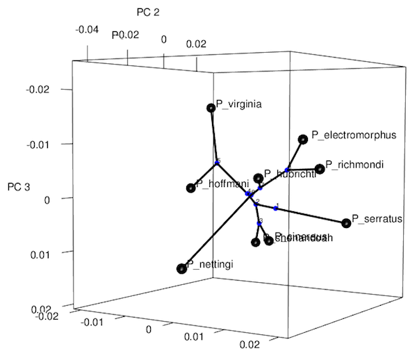


Using the option `zaxis = "time"`, the function plots a 3D phylomorphospace, with internal nodes positioned along the Z-axis scaled to time (a.k.a. Chronophylomorphospace, Sakamoto & Ruta 2012).
```{r eval=F}
plotGMPhyloMorphoSpace(plethspecies$phy,Y.gpa$coords, zaxis= "time",
                        plot.param=list(n.cex=2, n.bg="blue"), shadow=TRUE)
```

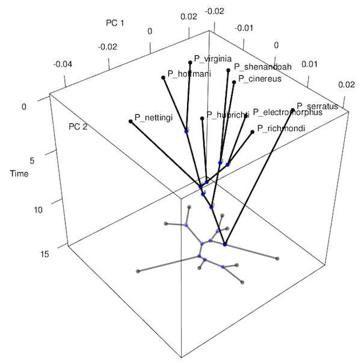


# Shape change graphs

## Plot shape differences between a reference and target specimen (`plotRefToTarget`)
Function plots shape differences between a reference and target specimen.

**Function**     
```
plotRefToTarget(M1, M2, mesh = NULL, outline = NULL, method = c("TPS",
  "vector", "points", "surface"), mag = 1, links = NULL, label = FALSE,
  gridPars = NULL, useRefPts = FALSE, ...)
```
**Arguments**  

 * *M1*	Matrix of landmark coordinates for the first (reference) specimen
 * *M2*	Matrix of landmark coordinates for the second (target) specimen
 * *mesh*	A mesh3d object for use with method="surface"
 * *outline* An x,y curve or curves warped to the reference (2D only)
 * *method*	Method used to visualize shape difference; see below for details
 * *mag*	The desired magnification to be used when visualizing the shape difference (e.g., mag=2)
 * *links*	An optional matrix defining for links between landmarks
 * *label*	A logical value indicating whether landmark numbers will be plotted
 * *gridPars*	An optional object made by `gridPar`
 * *useRefPts*	An option (logical value) to use reference configuration points rather than target configuration points (when method = "TPS") – NOT RECOMMENDED FOR NOVICE USERS
 * *...*	Additional parameters (not covered by gridPar) to be passed to plot, plot3d or shade3d.
 
The option mag allows the user to indicates the degree of magnification to be used when displaying the shape difference. The function will plot either two- or three-dimensional data. This function combines numerous plotting functions found in Claude (2008).

### The four plotting methods
A 2D data example
```{r}
data(plethodon)  # example dataset
Y.gpa<-gpagen(plethodon$land)  # GPA-alignment
ref<-mshape(Y.gpa$coords)
```
1. **TPS** a thin-plate spline deformation grid is generated. For 3D data, this method will generate thin-plate spline deformations in the x-y and x-z planes.
```{r fig.align='center'}
plotRefToTarget(ref,Y.gpa$coords[,,39], method="TPS")
 # magnify difference by 3X
plotRefToTarget(ref,Y.gpa$coords[,,39],mag=3, method="TPS")   
 # vector a plot showing the vector displacements between corresponding landmarks 
 # in the reference and target specimen is shown.
plotRefToTarget(ref,Y.gpa$coords[,,39],method="vector", mag=3)
```

2. **vector** a plot showing the vector displacements between corresponding landmarks in the reference and target specimen is shown (sometimes known as a "lollipop graph, sensu MorphoJ")
```{r}
plotRefToTarget(ref,Y.gpa$coords[,,39],method="vector",mag=3)
```

3. **points** a plot is displayed with the landmarks in the target (black) overlaying those of the reference (gray). Additionally, if a matrix of links is provided, the landmarks of the mean shape will be connected by lines. The link matrix is an M x 2 matrix, where M is the desired number of links. Each row of the link matrix designates the two landmarks to be connected by that link.
```{r}
plotRefToTarget(ref,Y.gpa$coords[,,39],method="points", mag=3)
```

In these first 3 methods, it is possible to add a wireframe or an outline to these plots. For more information on creating and importing an outline, see `warpRefOutline` (helper functions end of this chapter).
Using **links** (wireframe) for representation of your specimen. In TPS, vector & points in both 2D and 3D it is possible to add links to these plots. The links argument can be made by hand, using matrix, or there is a graphical assisted function `define.links`.

In the plethodon list, there is a matrix called `plethodon$links`
```
      [,1] [,2]
 [1,]    4    5
 [2,]    3    5
 [3,]    2    4
 [4,]    1    2
 [5,]    1    3
 [6,]    6    7
 [7,]    7    8
 [8,]    8    9
 [9,]    9   10
[10,]   10   11
[11,]   11   12
[12,]   12    1
[13,]    1    9
[14,]    1   10
```
```{r}
plotRefToTarget(ref,Y.gpa$coords[,,39],method="points", mag=3, links = plethodon$links)
```

In the plethodon list, there is a matrix called `plethodon$outline` to be added using the **outline** option. This requires first warping a referrence outline to the mean shape using the function `warpRefOutline` (see helper functions end of this chapter). 
```{r fig.align='center'}
plotRefToTarget(ref,Y.gpa$coords[,,39], method ="TPS", 
                outline=plethodon$outline)

plotRefToTarget(ref,Y.gpa$coords[,,39], mag=2, method ="points", 
                outline=plethodon$outline)
```

Now, a 3D data example using the three methods shown above 
```{r}
data(scallops)
Y.gpa<-gpagen(A=scallops$coorddata, curves=scallops$curvslide, 
surfaces=scallops$surfslide, PrinAxes = F)
ref<-mshape(Y.gpa$coords)
plotRefToTarget(ref,Y.gpa$coords[,,1],method="TPS", mag=3)
```
```{r eval=F}
plotRefToTarget(ref,Y.gpa$coords[,,1],method="vector", mag=3)
```

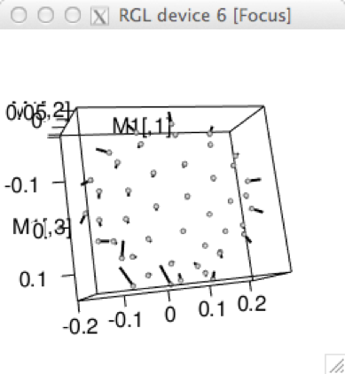 

```{r eval=F}
plotRefToTarget(ref,Y.gpa$coords[,,1],method="points", mag=3)
```

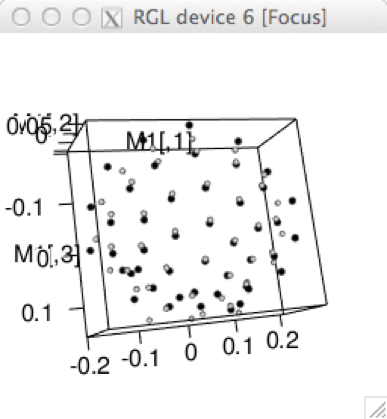 


4. **surface** a mesh3d surface is warped using thin-plate spline (for 3D data only). Requires mesh3d object in option mesh, made using `warpRefMesh` (see below), which provides a mesh3d object that is the shape of the sample mean. It is recommended that the mean shape is used as the reference for warping (see Rohlf 1998).
A 3D data example using the average mesh made with `warpRefMesh` 
(Note: this example is not included in the *geomorph* package, but show here for illustrative purposes).
```{r eval = FALSE}
ref <- mshape(Y.gpa$coords)  # calculate the mean shape from set of GPA-aligned specimens
plotRefToTarget(M1=ref, M2=Y.gpa$coords[,,1], mesh=averagemesh, method="surface")
 # averagemesh is a mesh made with warpRefMesh,
 # that is the shape of the mean of a set of specimens
```

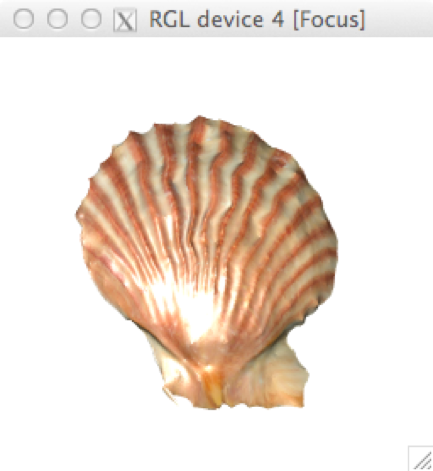 


Function plots the warped “target” shape (shown here against the mean for illustrative purposes only). This function can be used to show deformations between *any two sets of coordinates*. Coordinate data are provided by several functions, a few examples given below.

#### Example 1 `plotTangentSpace` 
Using `verbose=TRUE` returns a list containing shape coordinates ($pc.shapes) for the minimum and maximum shape on the two PCs plotted (default is PC1 and PC2) as four matrices. To use, enter the coordinate matrix into position M2, e.g.,
```{r}
data(plethodon)  # example dataset
Y.gpa<-gpagen(plethodon$land)     # GPA-alignment
res <- plotTangentSpace(Y.gpa$coords, 
                        groups = factor(paste(plethodon$species, plethodon$site)), 
                        verbose=TRUE)

layout(mat=matrix(c(1,2), ncol=2))  # set up two part layout for plotting
ref<-mshape(Y.gpa$coords)   # calculate mean shape
 # shape change along PC1 in the negative direction
plotRefToTarget(M1=ref, M2=res$pc.shapes$PC1min, method="TPS") 
 # shape change along PC1 in the positive direction
plotRefToTarget(M1=ref, M2=res$pc.shapes$PC1max, method="TPS") 
layout(1)  # reset to 1 graph per plot
```

#### Example 2 `procD.Allometry` 
`plot` of a `procD.allometry`object returns a list containing the shapes at the min and max size, which can be plotted as follows:
```{r}
data(ratland)  # example dataset
Y.gpa<-gpagen(ratland)     # GPA-alignment
 # perform the Multivariate Regression
Allom <- procD.allometry(Y.gpa$coords ~ Y.gpa$Csize) 
 # plot the Multivariate Regression and save the min/max shapes
res <- plot(Allom, method="RegScore", shapes=TRUE) 

layout(mat=matrix(c(1,2), ncol=2))  # set up two part layout for plotting
ref<-mshape(Y.gpa$coords)   # calculate mean shape
# Predicted shape at min centrod size
plotRefToTarget(ref, res$min.shape, method="vector", mag=2, axes=F, main = "minCsize")
# Predicted shape at max centrod size
plotRefToTarget(ref, res$max.shape, method="vector", mag=2, axes=F, main = "maxCsize")
layout(1)  # reset to 1 graph per plot
```

#### Example 3 `two.b.pls`, `integration.test` & `phylo.integration`  
`plot` of a `pls` object returns a list containing the shapes at the min and max of PLS1 axis for one or both blocks (only if the data were inputted as 3D arrays), which can be plotted as follows:
```{r comment=""}
data(plethShapeFood)  # example dataset 
Y.gpa<-gpagen(plethShapeFood$land)     # GPA-alignment  
PLS <-two.b.pls(Y.gpa$coords,plethShapeFood$food,iter=999)
res <- plot(PLS, shapes=TRUE)  # PLS plot

layout(mat=matrix(c(1,2), ncol=2))  # set up two part layout for plotting
ref<-mshape(Y.gpa$coords)   # calculate mean shape
# Predicted shape at min of PLS1 axis 1
plotRefToTarget(ref, res$pls1.min, method="TPS", mag=2, axes=F, main = "min of PLS1") 
# Predicted shape at max of PLS1 axis 1
plotRefToTarget(ref, res$pls1.max, method="TPS", mag=2, axes=F, main = "max of PLS1")
layout(1)  # reset to 1 graph per plot
```

#### Example 4, differences between groups
for groups shown to be significantly different with `procD.lm`, first average the data by groups, calculate group means and plot those means:
```{r}
data(plethodon)
Y.gpa<-gpagen(plethodon$land)     # GPA-alignment
 # calculate mean shape for each group
means <- aggregate(two.d.array(Y.gpa$coords) ~ plethodon$site, FUN=mean) 
 # make mean vectors as matrix
Allo.mn <- matrix(as.numeric(means[1,-1]), ncol=2, byrow=T) 
ref<-mshape(Y.gpa$coords)  # calculate mean shape
plotRefToTarget(ref, Allo.mn, method="TPS")  # shape of group
```

# Data inspection

## Plot landmark coordinates for all specimens (`plotAllSpecimens`)
Function plots landmark coordinates for a set of specimens.

**Function**     
```{r eval=F}
plotAllSpecimens(A, mean = TRUE, links = NULL, label = FALSE, plot.param = list())
```

**Arguments** 

 * *A*	A 3D array (p x k x n) containing GPA-aligned coordinates for a set of specimens
 * *mean*	A logical value indicating whether the mean shape should be included in the plot
 * *links*	An optional matrix defining for links between landmarks
 * *pointscale*	An optional value defining the size of the points for all specimens
 * *meansize*	An optional value defining the size of the points representing the average specimen

The function creates a plot of the landmark coordinates for all specimens. This is useful for examining patterns of shape variation after GPA. If "mean=TRUE", the mean shape will be calculated and added to the plot. Additionally, if a matrix of links is provided, the landmarks of the mean shape will be connected by lines. The link matrix is an m x 2 matrix, where m is the desired number of links. Each row of the link matrix designates the two landmarks to be connected by that link. The function will plot either two- or three-dimensional data.

Example for 2D data
data(plethodon)

```{r comment = ""}
Y.gpa<-gpagen(plethodon$land)  # GPA
plethodon$links  # look at links matrix
plotAllSpecimens(Y.gpa$coords,links=plethodon$links,label=T, 
                 plot.param = list(pt.bg = "green", mean.cex=1, link.col="red", 
                                   txt.pos=3, txt.cex=1))
```

Example for 3D data
```{r eval=F}
data(scallops)
Y.gpa <- gpagen(A=scallops$coorddata, curves=scallops$curvslide, 
                surfaces=scallops$surfslide)
scallinks <- matrix(c(1,rep(2:16, each=2),1), nrow=16, byrow=TRUE) # make links matrix
plotAllSpecimens(Y.gpa$coords,links=scallinks, 
                 plot.param= list(pt.bg = "blue",link.col="red"))
```

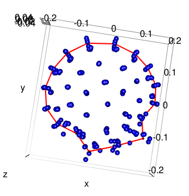 


**Protip!** Typing the name of the function in the console brings up the function code. The user can look at this code for ideas of how to customize their own graphs.


## Find potential outliers (`plotOutliers`)
Function plots a set of Procrustes-aligned specimens ordered by their distance from the mean shape. It is used as a tool to aid identifying specimens that have been digitized wrong (for example, mixing up landmark order). Specimens falling outside of the upper quartile range are potential outliers. We do not, however, stipulate that they must be removed or are wrong.

**Function**    
```{r eval=F}
`plotOutliers(A, groups = NULL)
```

**Arguments**   

 * *A*	A 3D array (p x k x n) containing landmark coordinates for a set of aligned specimens
 * *groups*	An optional factor defining groups

The function creates a plot of all specimens ordered by their Procrustes distance from the mean shape. In the graph, the median (unbroken line) and upper and lower quartiles (dashed lines) summarize the distances from the mean shape. Specimens falling above the upper quartile are plotted in red and their address returned, for inspection by `plotRefToTarget`. 

```{r}
data(plethodon)
 # let's make some outliers
newland <- plethodon$land  # make copy of example dataset
 # dataset needs dimnames for plotting reference so we shall assign arbitrary names
dimnames(newland)[[3]] <- paste("pleth", 1:dim(newland)[3], sep="")
newland[c(1,8),,2] <- newland[c(8,1),,2]  # swap lmks 1 and 8 of specimen 2
newland[c(3,11),,26] <- newland[c(11,3),,2]  # swap lmks 3 and 11 of specimen 26
Y <- gpagen(newland)  # perform GPA
plotOutliers(Y$coords)
```
If there are outliers, then we can view them:
```{r comment = ""}
outliers <- plotOutliers(Y$coords) # function returns dimname and address of outliers
plotRefToTarget(mshape(Y$coords),Y$coords[,,outliers[1]],method="vector", label = T)
plotRefToTarget(mshape(Y$coords),Y$coords[,,outliers[2]],method="vector", label = T)
```

The way that the arrows cross over each other in these two plots are classic examples of when two landmarks have been digitized in the wrong order (switched). In this case, either go back to the original specimen and redigitize. Or in *R*, you can switch the landmarks as we did above.

## Plot 3D specimen, fixed landmarks and surface semilandmarks (`plotspec`)
A function to plot three-dimensional (3D) specimen along with its landmarks.

**Function**    
`plotspec(spec, digitspec, fixed = NULL, ptsize = 1, centered = FALSE, ...)`

**Arguments**   

 * *spec*	An object of class shape3d/mesh3d, or matrix of 3D vertex coordinates.
 * *digitspec*	Name of data matrix containing 3D fixed and/or surface sliding coordinates.
 * *fixed*	Numeric The number of fixed template landmarks (listed first in digitspec)
 * *ptsize*	Numeric Size to plot the mesh points (vertices), e.g., 0.1 for dense meshes, 3 for sparse meshes
 * *centered*	Logical Whether the data matrix is in the surface mesh coordinate system (centered=FALSE) or if the data were collected after the mesh was centered (centered=TRUE)- see below
 * *...*	additional parameters which will be passed to plot3d.

Function to plot 3D specimens along with their digitized "fixed" landmarks and semilandmarks "surface sliders" and "curve sliders". If specimen is a 3D surface (class shape3d/mesh3d) mesh is plotted. For visualization purposes, 3D coordinate data collected using digit.fixed or digitsurface and buildtemplate prior to build 1.1-6 were centered by default. Therefore use this function with centered=TRUE. Data collected outside *geomorph* should be read using centered=FALSE. The function assumes the fixed landmarks are listed at the beginning of the coordinate matrix (digitspec).

### Example
```{r eval=FALSE}
data(scallopPLY) #load example dataset
plotspec(spec=scallopPLY$ply, digitspec=scallopPLY$coords, fixed=16, centered =TRUE)
```

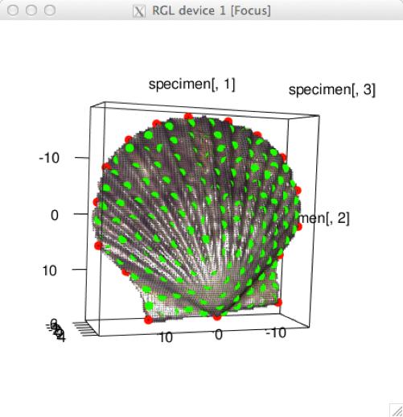 

The fixed landmarks and curve semilandmarks are in red, and the surface semilandmarks are in green.

# Plots for analytical functions
Many of *geomorph*'s analytical functions decribed in Vigentte 3 return information in the form of a list that can be used in the S3 generic function plot. 
 
## `plot` on objects from `gpagen`
Function calls `plotAllSpecimens` and plots landmark coordinates for a set of specimens.

## `plot` on objects from `bilat.symmetry`
Function plots the symmetric and asymmetric shape component, and the mean directional and fluctuating asymmeytry as shape change graphs.

### Example
```{r comment=""}
data(mosquito) #eaxmple dataset
gdf <- geomorph.data.frame(wingshape = mosquito$wingshape, 
                           ind=mosquito$ind, side=mosquito$side,
                           replicate=mosquito$replicate) # make geomorph data frame
mosquito.sym <- bilat.symmetry(A = wingshape, ind = ind, side = side,
       replicate = replicate, object.sym = FALSE, RRPP = TRUE, iter = 499, data = gdf)
plot(mosquito.sym, warpgrids = TRUE)
```

## `plot` on objects from `procD.allometry`
**Function**    
```{r eval=F}
plot(x, method = c("CAC", "RegScore", "PredLine"),
  warpgrids = TRUE, label = NULL, gp.label = FALSE, pt.col = NULL,
  mesh = NULL, shapes = TRUE, ...)
```
**Arguments**    

 * *x* plot object (from procD.allometry)
 * *method* Method for estimating allometric shape components
 * *warpgrids* A logical value indicating whether deformation grids for small and large shapes should be displayed (note: if groups are provided no TPS grids are shown)
 * *label* An optional vector indicating labels for each specimen that are to be displayed
 * *gp.label* A logical value indicating labels for each group to be displayed (if group was originally included); "PredLine" only
 * *pt.col* An optional vector of colours to use for points (as in points(bg=))
 * *mesh* A mesh3d object to be warped to represent shape deformation of the minimum and maximum size if warpgrids=TRUE (see warpRefMesh).
 * *shapes* Logical argument whether to return the the shape coordinates shape coordinates of the small and large shapes
 * *...* other arguments passed to plot
  
### Three plotting methods
1. If "method=CAC" (the default) the function calculates the common allometric component of the shape data, which is an estimate of the average allometric trend within groups (Mitteroecker et al. 2004). The function also calculates the residual shape component (RSC) for the data.

2. If "method=RegScore" the function calculates shape scores from the regression of shape on size, and plots these versus size (Drake and Klingenberg 2008). For a single group, these shape scores are mathematically identical to the CAC (Adams et al. 2013).

3. If "method=PredLine" the function calculates predicted values from a regression of shape on size, and plots the first principal component of the predicted values versus size as a stylized graphic of the allometric trend (Adams and Nistri 2010).

### Example
Comparing allometric slopes between groups (Homogeneity of Slopes Test)
```{r comment=""}
data(plethodon) # example dataset
Y.gpa <- gpagen(plethodon$land)    # GPA-alignment
# make geomorph data frame
gdf <- geomorph.data.frame(shape = Y.gpa$coords, cs = Y.gpa$Csize, 
                           site = plethodon$site, species = plethodon$species) 
# simple allometry
plot(procD.allometry(shape~cs, logsz = TRUE, data=gdf, iter=499, RRPP=TRUE), 
     method = "RegScore", warpgrids = T)

# Comparing allometric slopes between groups
plethAllometry <- procD.allometry(shape~cs, ~species*site,
logsz = TRUE, data=gdf, iter=499, RRPP=TRUE)
  plot(plethAllometry, method = "PredLine")
  col.gp<-c(rep("black",10),rep("red",10),
            rep("yellow",10),rep("orange",10))  # not a factor
  plot(plethAllometry, method = "PredLine", pt.col = col.gp) # change colour of points
```

## `plot` on objects from `advanced.procD.lm`, `procD.lm`, `procD.pgls` and `procD.allometry`
Plots the following graphs:

 * *PCA Residuals* A PCA of the residuals (observed responses - fitted responses).
 * *Q-Q plot* Evaluate the normality of a variable using a Q-Q plot.
 * *Residuals vs. PC1 fitted* Residuals plotted against the first PC axis of fitted values, in order to verify the assumption that the residuals are randomly distributed and have constant variance.
 * *Residuals vs. Fitted* Procrustes distance of fitted values vs. Procrustes distance of residuals, alternative to the above plot.
 * *Outliers (if outliers= TRUE)* calls `plotOutliers`, to identify potential outliers.

### Example
```{r comment=""}
data(ratland) # example dataset
rat.gpa<-gpagen(ratland)         # GPA-alignment
gdf <- geomorph.data.frame(rat.gpa) # make geomorph data frame
rat.anova <- procD.lm(coords ~ Csize, data = gdf, iter = 999, RRPP = TRUE)
plot(rat.anova) # diagnostic plots
```

## `plot` on objects from `phylo.modularity` and `modularity.test`
Plots a histogram of the Covariance ratio (CR, the estimate of the observed modular signal) sampling distribution. The arrow points to the observed CR, and the grey bars are the permuted values. 

## `plot` on objects from `compare.evol.rates` and `compare.multi.evol.rates`
Plots a histogram of the ratio of maximum to minimum evolutionary rates sampling distribution. The arrow points to the observed ratio, and the grey bars are the permuted values. 

## `plot` on objects from `physignal`
Plots a histogram of the ratio of K (estimate of phylogenetic signal) sampling distribution. The arrow points to the observed K, and the grey bars are the permuted values. 

## `plot` on objects from `two.b.pls`, `integration.test` and `phylo.integration`
**Function**    
```{r eval=F}
plot(x, label = NULL, warpgrids = TRUE, shapes = TRUE, ...)
```

**Arguments**  

 * *x* plot object (from `integration.test`, `phylo.integration` or `two.b.pls`)
 * *label* An optional vector indicating labels for each specimen that are to be displayed
 * *warpgrids* A logical value indicating whether deformation grids for extreme ends of axis1 and axis2 should be displayed (if data were originaly input as 3D array)
 * *shapes* Logical argument whether to return the the shape coordinates shape coordinates of the extreme ends of axis1 and axis2
 * *...* other arguments passed to plot

### Example
```{r comment=""}
data(plethodon)  # example dataset
Y.gpa<-gpagen(plethodon$land) # GPA-alignment
#landmarks on the skull and mandible assigned to partitions
land.gps<-c("A","A","A","A","A","B","B","B","B","B","B","B") 
IT <- integration.test(Y.gpa$coords, partition.gp=land.gps, iter=999)
plot(IT) # PLS plot
```

## `plot` on objects from `trajectory.analysis`
**Function**    
`plot(x, group.cols = NULL,
  pt.seq.pattern = c("white", "gray", "black"), pt.scale = 1, ...)`

**Arguments**  

 * *x* plot object (from  trajectory.analysis )
 * *group.cols* An optional vector of colors for group levels
 * *pt.seq.pattern* The sequence of colors for starting, middle, and end points of trajectories, respectivly. e.g., c("green", "gray", "red") for gray points but initial points with green color and end points with red color.
 * *pt.scale* An optional value to magnify or reduce points (1 = no change)
 * *...* other arguments passed to plot

### Example
```{r comment=""}
# Motion paths represented by 5 time points per motion 
data(motionpaths) #example datset
gdf <- geomorph.data.frame(trajectories = motionpaths$trajectories,
                            groups = motionpaths$groups)
TA <- trajectory.analysis(f1 = trajectories ~ groups, 
                           traj.pts = 5, data=gdf, iter=199)
plot(TA)
plot(TA, group.cols = c("dark red", "dark blue", "dark green", "yellow"), 
pt.seq.pattern = c("green", "gray30", "red"), pt.scale = 1.3)
```

******

## Helper functions

### Set up parameters for grids, points, and links in plotRefToTarget (`gridPar`)
Function allows users to vary certain plotting parameters to produce different graphical outcomes for `plotRefToTarget`. Not all parameters need to be adjusted to use this function, as the defaults above will be used.

**Function**    
```
gridPar(pt.bg = "gray", pt.size = 1.5, link.col = "gray", link.lwd = 2,
  link.lty = 1, out.col = "gray", out.cex = 0.1, tar.pt.bg = "black",
  tar.pt.size = 1, tar.link.col = "black", tar.link.lwd = 2,
  tar.link.lty = 1, tar.out.col = "black", tar.out.cex = 0.1,
  n.col.cell = 20, grid.col = "black", grid.lwd = 1, grid.lty = 1,
  txt.adj = 0.5, txt.pos = 1, txt.cex = 0.8, txt.col = "black")
```

**Arguments**   

 * *pt.bg* Background color of reference configuration points (single value or vector of values)
 * *pt.size* Scale factor for reference configuration points (single value or vector of values)
 * *link.col* The color of links for reference configurations (single value or vector of values)
 * *link.lwd* The line weight of links for reference configurations (single value or vector of values)
 * *link.lty* The line type of links for reference configurations (single value or vector of values)
 * *out.col* The color of outline for reference configurations (single value or vector of values)
 * *out.cex* The size of plotting symbol of outline for reference configurations (single value or vector of values)
 * *tar.pt.bg* Background color of target configuration points (single value or vector of values)
 * *tar.pt.size* Scale factor for target configuration points (single value or vector of values)
 * *tar.link.col* The color of links for target configurations (single value or vector of values)
 * *tar.link.lwd* The line weight of links for target configurations (single value or vector of values)
 * *tar.link.lty* The line type of links for target configurations (single value or vector of values)
 * *tar.out.col* The color of outline for target configurations (single value or vector of values)
 * *tar.out.cex* The size of plotting symbol of outline for target configurations (single value or vector of values)
 * *n.col.cell* The number of square cells (along x axis) for grids (single numerical value)
 * *grid.col* The color of grid lines (single value)
 * *grid.lwd* Scale factor for the weight of grid lines (single numerical value)
 * *grid.lty* The line type for grid lines (single numerical value, as in base *R* plot)
 * *txt.adj* The adjustment value of the landmark label (one or two values, as in base *R* text)
 * *txt.pos* The position of the landmark label (single numerical value, as in base *R* text)
 * *txt.cex* The size of the landmark label text (single numerical value, as in base *R* text)
 * *txt.col* The color of the landmark label text (single numerical value, as in base *R* text)

**Examples**
```{r fig.align='center'}
data(plethodon) # example dataset
Y.gpa<-gpagen(plethodon$land)    #GPA-alignment
ref<-mshape(Y.gpa$coords)

# Altering points and links
GP1 <- gridPar(pt.bg = "red", pt.size = 1, link.col="blue", link.lwd=2, n.col.cell=50)
plotRefToTarget(ref,Y.gpa$coords[,,39], gridPars=GP1, mag=2, 
links=plethodon$links, method="TPS")

# Altering point color
GP2 <- gridPar(pt.bg = "green", pt.size = 1) 
plotRefToTarget(ref,Y.gpa$coords[,,39], gridPars=GP2, mag=3, method="vector")

# Altering ref and target points
GP3 <- gridPar(pt.bg = "blue", pt.size = 1.5, tar.pt.bg = "orange", tar.pt.size = 1) 
plotRefToTarget(ref,Y.gpa$coords[,,39], gridPars=GP3, mag=3, method="points")

# Altering outline color
GP4 <- gridPar(tar.out.col = "red", tar.out.cex = 0.3) 
plotRefToTarget(ref,Y.gpa$coords[,,39], gridPars=GP4, mag=3, 
outline=plethodon$outline, method="TPS")

# Altering text labels
GP5 <- gridPar(txt.pos = 3, txt.col = "red") 
plotRefToTarget(ref,Y.gpa$coords[,,39], gridPars=GP5, mag=3, method="vector", label=TRUE)
```

### Find the mean specimen (`findMeanSpec`)

**Function**    
`findMeanSpec(A)`

**Arguments**    

A function to identify which specimen lies closest to the estimated mean shape for a set of aligned specimens. A is a 3D array (p x k x n) containing landmark coordinates for a set of aligned specimens. This function is used to facilitate finding a specimen to use with `warpRefMesh` or `warpRefOutline`.

```{r eval=FALSE}
findMeanSpec(Y.gpa$coords)  # GPA-aligned coordinates
specimen7      # returns the name of the specimen
25             # returns the specimen number (where it appears in the 3D array)
```

### Create an outline object warped to the mean shape (`warpRefOutline`)
A function to take an outline (defined by many points) and use thin-plate spline method to warp the outline into the estimated mean shape for a set of aligned specimens. This outline is used plotRefToTarget where outline= option is available.

**Function**     
```{reval=F}
warpRefOutline(file, mesh.coord, ref, color = NULL, centered = FALSE)
```

**Arguments**  

 * *file*	A .txt or .csv file of the outline point coordinates, or a .TPS file with OUTLINES= or CURVES= elements
 * *coord*	A p x k matrix of 2D coordinates digitized on the ply file.
 * *ref*	A p x k matrix of 2D coordinates made by mshape

Function takes an outline (defined by many points) with a set of fixed landmark coordinates and uses the thin-plate spline method (Bookstein 1989) to warp the outline into the shape defined by a second set of landmark coordinates, usually those of the mean shape for a set of aligned specimens. It is highly recommended that the mean shape is used as the reference for warping (see Rohlf 1998). 
For file, it is necessary to have in the working directory a .txt, .csv, .TPS file containing coordinate data of the outline(s). An outline is made up of many points, each defined by an x and y coordinate. 

#### To make an outline txt file in ImageJ (http://imagej.nih.gov/ij/):

 * Import an 8-bit black and white drawing of an outline drawn from one of your digitized specimens
    a.	use Image > Type > 8-bit to convert if necessary
    b.	use Image > Adjust > Threshold to make B&W 
 * Process > Binary > Skeletonize the image to find a single (pixel width line around the image)
 * Analyze > Tools > Save XY Coordinates to save the coordinates of all of the pixels (you may need to invert the y coordinate option).
This text file will have three columns – the third is a column of RGB values, and needs to be deleted.
NOTE: It is important that the coordinate system of these outline points matches that of the digitized landmarks. If this is not the case, digitize a fake specimen on this outline, and save those landmark coordinates to be used in the coord argument. 

#### To make an outline TPS file in tpsDIG2 (http://life.bio.sunysb.edu/morph/soft-dataacq.html):
 * Import an image file using File > Input source
 * Using Modes > Outline mode, highlight one outline on the image
 * Right click on the outline, and choose Save as XY cords, and you will be prompted to the number of points you want the outline to be saved as (stay with the default all). Click OK
 * Repeat for all outline segments
 * To finish, File >  Save data as... and save a .tps file. 
Once you have an outline, the workflow in *R* is as follows:
 * Calculate the mean shape using mshape
 * Choose an actual specimen to use for the warping. The specimen used as the template for this warping is recommended as one most similar in shape to the average of the sample, but can be any reasonable specimen – do this by eye, or use `findMeanSpec`
 * Warp this specimen into the mean shape using `warpRefOutline`
 * Use this average outline where it asks for a outline= in `plotRefToTarget`

#### Workflow
I.	Calculate the mean shape using `mshape`
```{r eval=FALSE}
 # mydata is 3D array of coordinate data
ref <- mshape(mydata)
```
II.	Choose an actual specimen to use for the warping. The specimen used as the template for this outline warping is recommended as one most similar in shape to the average of the sample, but can be any reasonable specimen – do this by eye, or use `findMeanSpec`.

III. Warp this specimen's outline into the mean shape using `warpRefOutline`
```{r eval=FALSE}
# read in original coordinate data for a specimen chosen in step 2
sp7 <- readmulti.nts("specimen7.nts") 
# run function to create mean shape outline
av.outline <- warpRefOutline("specimen7outline.txt", sp7, ref)
attributes(av.outline)
$names
[1] "outline" "npoints" 
```

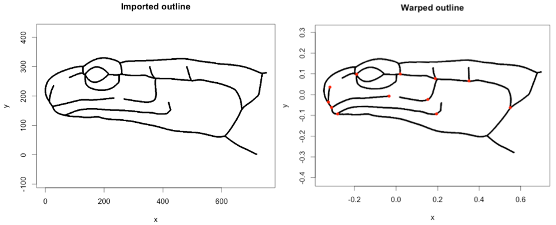

IV. For further visualiations, use av.outline$outline where `outline=` is specified. `npoints` is a list of the number of points for each curve, and is currently not used in *geomorph* but will be in future versions. 


### Create a mesh3d object warped to the mean shape (`warpRefMesh`)
A function to take a .ply file and use thin-plate spline method to warp the file into the estimated mean shape for a set of aligned specimens. This mesh is used in functions where mesh= option is available.

**Function**   
```{r eval=F}
warpRefMesh(file, mesh.coord, ref, color = NULL, centered = FALSE)
```

**Arguments**  

 * *file*	An ASCII ply file
 * *mesh.coord*	A p x k matrix of 3D coordinates digitized on the ply file.
 * *ref*	A p x k matrix of 3D coordinates made by `mshape`
 * *color*	Color to set the ply file $material. If the ply already has color, use NULL. For ply files without color, color=NULL will be plotted as grey.
 * *centered*	Logical If the data in mesh.coords were collected from a centered mesh (see below).

Function takes a 3D surface mesh in the format of a .ply file and the digitized landmark coordinates uses the thin-plate spline method (Bookstein 1989) to warp the mesh into the shape defined by a second set of landmark coordinates, usually those of the mean shape for a set of aligned specimens. It is highly recommended that the mean shape is used as the reference for warping (see Rohlf 1998). 

#### Workflow
I.	Calculate the mean shape using `mshape`
```{r eval=FALSE}
 # mydata is 3D array of coordinate data
ref <- mshape(mydata)
```
II.	Choose an actual specimen to use for the warping. The specimen used as the template for this warping is recommended as one most similar in shape to the average of the sample, but can be any reasonable specimen – do this by eye, or use `findMeanSpec`.

III. Warp this specimen into the mean shape using `warpRefMesh`
```{r eval=FALSE}
# read in original coordinate data for a specimen chosen in step 2
sp7 <- readmulti.nts("specimen7.nts") 
# read in surface mesh (.ply file) for a specimen chosen in step 2
sp7.ply <- read.ply("specimen7.ply")
# run function to create mean shape mesh
averagemesh <- warpRefMesh(sp7.ply, sp7, mshape(mydata))
```

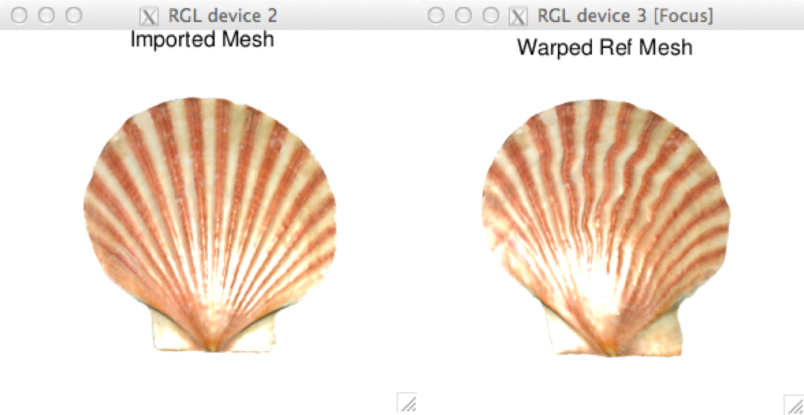

IV.	Use this average mesh where it asks for a `mesh=` in the visualization functions
For landmark coordinates digitized with *geomorph* digitizing functions `centered=TRU` by default. This refers to the specimen being centered prior to landmark acquisition in the RGL window. For landmark data collected outside of *geomorph*, `centered=FALSE` will usually be the case. The returned mesh3d object is for use in *geomorph* functions where shape deformations are plotted and mesh= option is available (`plotTangentSpace`, `plotRefToTarget`, and using plot on several analytical functions). 

The "averagemesh" can also be saved to the working directory using the rgl function `writePLY`.

# Digitizing
This chapter will cover *geomorph's* digitizing functions, to collect 2D and 3D data for geometric morphometric analysis. The functions included in *geomorph* are offered as alternatives to other software for 2D landmark data collection such as [tpsDIG2](http://life.bio.sunysb.edu/morph/soft-dataacq.html), and [ImageJ](http://imagej.nih.gov/ij/), and 3D landmark data collection such as [IDAV landmark](http://www.idav.ucdavis.edu/research/EvoMorph). 

## 2D data collection (`digitize2d`)
An interactive function to digitize two-dimensional landmarks from .jpg files. This function works very similarly to TPSdig software by J. Rohlf, allowing a list of files to be processed sequentially.

**Function**  
```{r eval=FALSE}
digitize2d(filelist, nlandmarks, scale = NULL, tpsfile, verbose = TRUE)
```

**Arguments** 

 * *filelist*	A list of names of jpeg images to be digitized.
 * *nlandmarks*	Number of landmarks to be digitized.
 * *scale*	An optional vector containing the length of the scale to be placed on each image.
 * *tpsfile*	The name of a TPS file to be created or read.
 * *verbose*	User decides whether to digitize in verbose or silent format (see details), default is verbose

This function may be used for digitizing 2D landmarks from jpeg images (.jpg). The user provides a list of image names, the number of landmarks to be digitized, and the name of an output TPS file. The list can be made manually, using `c` or `list.files` base functions e.g.,
```{r eval=FALSE}
filelist <- c("specimen1.jpg", "specimen1.jpg") 
# or 
filelist <- list.files(pattern = "*.jpg")
```

Digitizing landmarks from 2D photos requires that a scale bar is placed in the image in order to scale the coordinate data. The 'scale' option requires: a single number (e.g. 10) which means that the scale to be measured in all images is a 10mm scale bar; OR a vector the same length as the filelist containing a number for the scale of each image. If scale=NULL, then the digitized coordinates will not be scaled. This option is NOT recommended.

Landmarks to be digitized can include both fixed landmarks and semi-landmarks, the latter of which are to be designated as "sliders" for subsequent analysis (see the function `define.sliders`). Users may digitize all specimens in one session, or may return at a later time to complete digitizing. In the latter case, the user provides the same filelist and TPS file and the function will determine where the user left off. If specimens have missing landmarks, these can be incorporated during the digitizing process using the 'a' option as described below (a = absent).

### Digitizing
Digitizing landmarks involves landmark selection using a mouse in the plot window, using the LEFT mouse button (or regular button for Mac users):
Digitize the scale bar by selecting the two end points (single click for start and end). The user is asked whether the system should keep or discard the digitized scale bar.
```{r eval=FALSE}
digitize2d(filelist nlandmarks=11, scale=3, tpsfile = "salamaders.tps"),verbose = TRUE)
Only 1 scale measure provided. Will use scale = 3  for all specimens.
Digitizing specimen  1  in filelist 
Set scale = 3
```

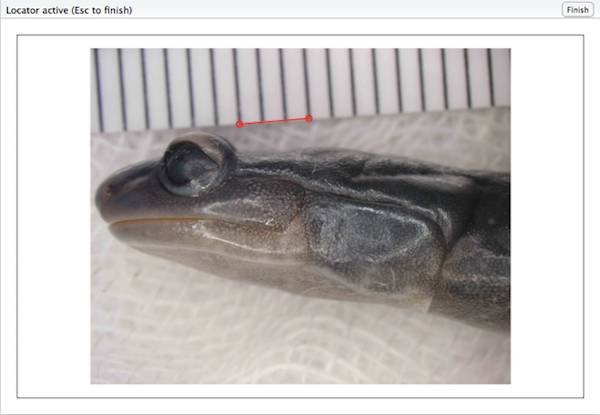 

```{r eval=FALSE}
Keep scale (y/n)?
y
```
Now, digitize each landmark with single click and the landmark is shown in red.
```{r eval=FALSE}
Select landmarks 1:11
```

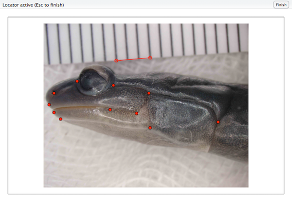 


If`verbose = TRUE`, digitizing is interactive between landmark selection using a mouse and the *R* console. Once a landmark is selected, the user is asked if the system should keep or discard the selection (y/n/a). If "y", the user is asked to continue to select the next landmark. If "n", the user is asked to select it again.
To **digitize a missing landmark**, simply click on any location in the image. Then, when prompted to keep selection, choose 'a' (for absent). Missing landmarks can only be included during the digitizing process when `verbose=TRUE`.
If `verbose = FALSE` (as in the example above) the digitizing of landmarks is continuous and uninterrupted. Here the user will not be prompted to approve each landmark selection.
At the end of digitizing, the landmark coordinates and the scale are written to a TPS file.

*salamander.tps*
```
LM = 11
0.913794820018337  0.728605670332276
1.04745503254995  0.58684483885935
0.654575013896415  0.765058455568172
0.168537877417812  0.671901337743106
0.103732925887331  0.736706289273586
0.0551292122394711  0.813662169216032
0.103732925887331  0.927070834394373
0.330550256244013  1.04452980904337
0.686977489661655  1.00402671433682
1.03530410413799  0.927070834394373
1.71575609520803  0.643549171448521
ID=mvz206608l
...
```
      
##	3D data collection: landmarks (`digit.fixed`)
An interactive function to digitize three-dimensional (3D) landmarks. Input for the function is either a matrix of vertex coordinates defining a 3D surface object or a mesh3d object as obtained from `read.ply` (see below).
**Function**  
```{r eval=FALSE}
digit.fixed(spec, fixed, index = FALSE, ptsize = 1, center = TRUE)
```

**Arguments**  

 * *spec*	An object of class shape3d/mesh3d, or matrix of 3D vertex coordinates
 * *fixed*	Numeric The number landmarks (fixed, and curve sliders if desired)
 * *index*	Logical Whether selected landmark addresses should be returned
 * *ptsize*	Numeric Size to plot the mesh points (vertices), e.g., 0.1 for dense meshes, 3 for sparse meshes
 * *center*	Logical Whether the object 'spec' should be centered prior to digitizing (default center=TRUE)

Function for digitizing "n" three-dimensional landmarks. The landmarks are "fixed" (traditional landmarks). They can be later designated as "curve sliders" (semilandmarks, that will "slide" along curves lacking known landmarks if required. A sliding semi-landmark ("sliders") will slide between two designated points, along a line tangent to the specified curvature, and must be defined as "sliders" using function `define.sliders` or with similar format matrix made outside *R*. For 3D "surface sliders" (surface semilandmarks that slide over a surface) the function `digitsurface` should be used instead. 
NOTE: Function centers the mesh before digitizing by default (center=TRUE). If one chooses not to center, specimen may be difficult to manipulate in rgl window.

### Digitizing
3D Digitizing functions in *geomorph* are interactive between landmark selection using a mouse (see below for instructions), and the R console. Once a point is selected, the user is asked if the system should keep or discard the selection (y/n). If "y", the user is asked to continue to select the next landmark. If "n" the removes the last chosen landmark, and the user is asked to select it again. This can be repeated until the user is comfortable with the landmark chosen.
To digitize with a standard 3-button (PC):
 * the RIGHT mouse button (primary) to select points to be digitized (click on a vertex to select)
 * the LEFT mouse button (secondary) is used to rotate mesh,
 * the mouse SCROLLER (third/middle) is used to zoom in and out.
NOTE: Digitizing functions on MACINTOSH computers using a standard 3-button mice works as specified. Macs using platform specific single button mice:
 * press button to rotate 3D mesh,
 * press button while pressing COMMAND key to select points to be digitized (click on a vertex to select)
 * press button while pressing OPTION key to adjust mesh perspective.
 * the mouse SCROLLER or trackpad two finger scroll is used to zoom in an out.
XQuartz must be configured: go to Preferences > Input > tick “Emulate three button mouse”.
NOTE: there is no pan (translate) functionality in rgl library for all platforms at this time. This is why the function has a center=TRUE/FALSE option.

**Example**
reading in a mesh with 24700 vertices
```{r eval=F}
mandible <- read.ply("Mandible.ply")
digit.fixed(mandible, fixed=20, index=F, ptsize=1, center=T)
Select Landmark 1 #
Keep landmark 1(y/n)? #See picture step 2
y
Select Landmark 2 #See picture step 2
Keep landmark 2(y/n)? 
y
Select Landmark 3 #See picture step 1
```

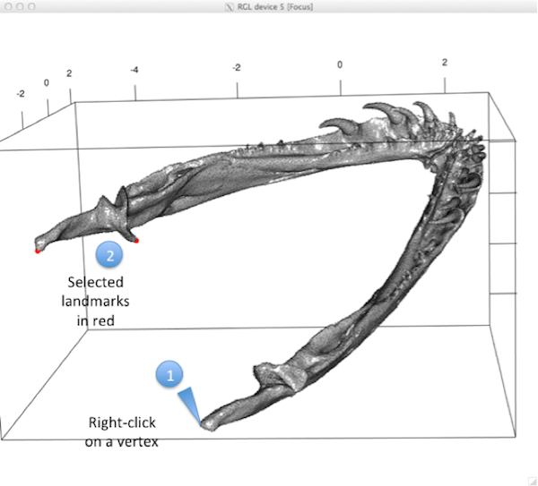 


Function writes to the working directory an NTS file with the name of the specimen and .nts suffix containing the landmark coordinates. 

*mandible.nts*
```
"mandible
1 20 3 0 dim=3
13.2628089578878 10.2361171749175 -3.49646546534654
9.32980895788779 18.7309171749175 -1.94616546534654
-2.70691104211221 17.5351171749175 0.852234534653466
-13.7911610421122 15.6363171749175 0.945934534653464
-14.1681010421122 6.40941717491749 0.853034534653467
...
```

If `index=FALSE`  (default) function returns to the console an n x 3 matrix containing the x,y,z coordinates of the digitized landmarks. If `index=TRUE`, function returns a list containing a matrix containing the x,y,z coordinates of the digitized landmarks ($selected) and a matrix of addresses for landmarks that are "fixed" ($fix, primarily for internal use).
YouTube video of this function in action here: http://youtu.be/VK6bLbb4ipY

##	Importing 3D surface files (`read.ply`)
A function to read ply files, which can be used for digitizing landmark coordinates or for shape warps. Other 3D file formats are currently not supported. Other files can be converted to ply using for example [**Meshlab**](http://meshlab.sourceforge.net).

**Function**  
```{r eval=FALSE}
read.ply(file, ShowSpecimen = TRUE, addNormals = TRUE)
```

**Arguments**  

 * *file*	An ASCII ply file
 * *ShowSpecimen*	A logical value indicating whether or not the ply file should be displayed
 * *addNormals*	A logical value indicating whether or not the normal of each vertex should be calculated (using addNormals [rgl])

Function reads three-dimensional surface data in the form of a single ply file (Polygon File Format; ASCII format only, from 3D scanners such as NextEngine and David scanners). Vertices of the surface may then be used to digitize three-dimensional points, and semilandmarks on curves and surfaces. The function opens the ply file and plots the mesh, with faces rendered if file contains faces, and colored if the file contains vertex color. 

### Example
reading a file called `myply.ply` in the working directory
```{r eval=F}
read.ply(“myply.ply”, ShowSpecimen=TRUE) 

# view an example in the geomorph package
data(scallopPLY)
myply <- scallopPLY$ply
attributes(myply)
$names
[1] "vb"            "it"            "primitivetype" "material"     

$class
[1] "mesh3d"  "shape3d"
plot3d(myply) # left image
# change color of mesh
myply$material <- "gray" # using color word (middle image)
myply$material <- "#FCE6C9" # using RGB code (right image)
```

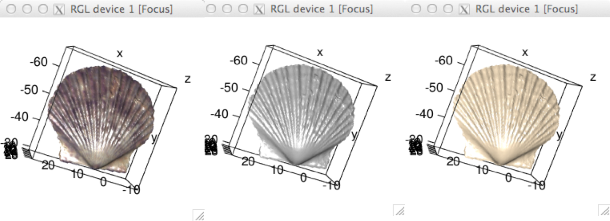 


##	3D data collection: landmarks and semilandmarks (`buildtemplate`)
An interactive function to build template of three-dimensional surface sliding semilandmarks. Input for the function is either a matrix of vertex coordinates defining a 3D surface object or a mesh3d object as obtained from `read.ply`.

```{r eval=F}
buildtemplate(spec, fixed, surface.sliders, ptsize = 1, center = TRUE)
```

**Arguments** 

 * *spec*	Name of surface file, as either an object of class shape3d/mesh3d, or matrix of three-dimensional vertex coordinates.
 * *fixed*	Either: a single value designating the number of fixed template landmarks to be selected by digit.fixed, OR a p-x-k matrix of 3D coordinates collected previously (e.g. in other software)
 * *surface.sliders*	The number of template surface sliders desired
 * *ptsize*	Size to plot the mesh points (vertices), e.g., 0.1 for dense meshes, 3 for sparse meshes
 * *center*	Logical Whether the object 'spec' should be centered prior to digitizing (default center=TRUE)

Function constructs a template of fixed landmarks and n "surface sliders", semilandmarks that slide over a surface. The user digitizes the fixed points, then the function finds n surface semilandmarks following algorithm outlined in Gunz et al. (2005) and Mitteroecker and Gunz (2009). Surface semilandmarks are roughly equidistant set of predetermined number of points, chosen over the mesh automatically using a nearest-neighbor approach. The set of fixed and surface slider landmarks are exported as a "template", which is used to extract a set of similarly numbered landmarks on every specimen using function `digitsurface`. Some of the "fixed" landmarks can be later designated as "curve sliders" using function `define.sliders` if required - see details in `digit.fixed`.
To ensure a strong match between the scan and the template, it is recommended that a reasonable number of fixed points be used. These fixed points can be designated as "curve sliders" later using function `define.sliders`, see the function `digit.fixed` for details. NOTE: Function centers the mesh before digitizing by default (`center=TRUE`). If one chooses not to center, specimen may be difficult to manipulate in rgl window. 


### Digitizing
as before in `digit.fixed`, digitizing 16 landmarks on a mesh and then automatically calculate 150 surface sliding semilandmarks
```{r eval=F}
myply1 <- read.ply("myply1.ply", ShowSpecimen=FALSE)
buildtemplate(myply1, 16, 150, ptsize=1)
Select Landmark 1 #See picture step 1
Keep landmark 1(y/n)? #See picture step 2
y
```

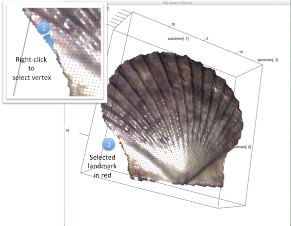


Select all of the fixed landmarks, and then the function will calculate the position of the surface sliding landmarks on the mesh, and plot them in blue.

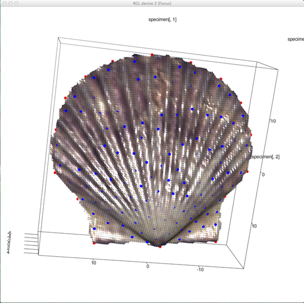


Function writes to the working directory three files: an NTS file with the name of the specimen and .nts suffix containing the landmark coordinates, "template.txt" containing the same coordinates for use with the function `digitsurface`, and "surfslide.csv", a file containing the address of the landmarks defined as "surface sliders" for use with `gpagen`. Function also returns to console an n x 3 matrix containing the x,y,z coordinates of the digitized landmarks.

*myply1.nts*
```
"myply1
1 166 3 0 dim=3
13.2628089578878 10.2361171749175 -3.49646546534654
9.32980895788779 18.7309171749175 -1.94616546534654
-2.70691104211221 17.5351171749175 0.852234534653466
-13.7911610421122 15.6363171749175 0.945934534653464
-14.1681010421122 6.40941717491749 0.853034534653467
...
```

*template.txt*
 ```
"xpts" "ypts" "zpts"
13.2628089578878 10.2361171749175 -3.49646546534654
9.32980895788779 18.7309171749175 -1.94616546534654
-2.70691104211221 17.5351171749175 0.852234534653466
-13.7911610421122 15.6363171749175 0.945934534653464
-14.1681010421122 6.40941717491749 0.853034534653467
...
```

*surfslide.csv*
```
x
17
18
19
20
21
22
23
...
```

which can be read in for use with `gpagen`.
```{r eval=F}
sliders <- as.matrix(read.csv("surfslide.csv", header=T))
```

YouTube video of this function in action here: http://youtu.be/7WWvImA2QE4

### AUTO mode
The function as described above (for interactive mode) calls `digit.fixed`, prompting the user to select fixed landmarks in the rgl window. However if the user has digitized these fixed landmark elsewhere (e.g., in other software), then the input for parameter 'fixed' can be a p-x-k matrix of 3D coordinates. In this case, the function will automatically use these landmarks to build the template of sliding semilandmarks.

### `editTemplate`
An interactive function to remove landmarks from a 3D template file.
**Function**   
```{r eval=FALSE}
editTemplate(template, fixed, n)
```
**Arguments** 

 * *template*	Matrix of template 3D coordinates.
 * *fixed*	Number of "fixed" landmark points (non surface sliding points)
 * *n*	Number of points to be removed
 
Function edits a 'template.txt' file made by `buildtemplate`, which must be in current working directory. Function overwrites 'template.txt' in working directory with edited version. Use read.table("template.txt", header = T).

```{r eval=FALSE}
editTemplate(template, fixed=16, n=2)
Remove Template Points 
1 of 2 points have been removed 
2 of 2 points have been removed 
```

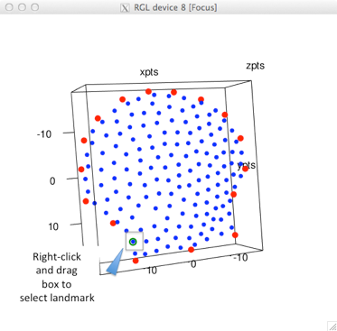 


## 3D data collection: landmarks and semilandmarks (`digitsurface`)
An interactive function to digitize three-dimensional (3D) landmarks on a surface lacking known landmarks. Input for the function is either a matrix of vertex coordinates defining a 3D surface object or a mesh3d object as obtained from `read.ply`.

**Function**  
```{r eval=FALSE}
digitsurface(spec, fixed, ptsize = 1, center = TRUE)
```

**Arguments**  

 * *spec*	Name of surface file, as either an object of class shape3d/mesh3d, or matrix of three-dimensional vertex coordinates.
 * *fixed*	Either: a single value designating the number of fixed template landmarks to be selected by digit.fixed, OR a p-x-k matrix of 3D coordinates collected previously (e.g. in other software)
 * *ptsize*	numeric: Size to plot the mesh points (vertices), e.g., 0.1 for dense meshes, 3 for sparse meshes
 * *center*	Logical Whether the object 'spec' should be centered prior to digitizing (default center=TRUE)

Function for digitizing fixed 3D landmarks and placing "surface sliders", semilandmarks that slide over a surface. Following selection of fixed points (see digitizing below), function finds surface semilandmarks following algorithm outlined in Gunz et al. (2005) and Mitteroecker and Gunz (2009). digitsurface finds the same number of surface semilandmarks as the “template.txt” file (created by `buildtemplate`) by downsampling scanned mesh, registering template with current specimen via GPA. A nearest neighbor algorithm is used to match template surface landmarks to current specimen's. To use function digitsurface, the template must be constructed first, and “template.txt” be in the working directory.
Some of the "fixed" landmarks digitized with digitsurface can be later designated as "curve sliders" using function `define.sliders` if required (see details in `digit.fixed`). NOTE: Function centers the mesh before digitizing by default (center=TRUE). If one chooses not to center, specimen may be difficult to manipulate in rgl window.
Digitizing: as before in `digit.fixed`.

**Example**, digitizing 16 landmarks on a mesh and fit a template to add 150 surface sliding semilandmarks
```{r eval=F}
myply2 <- read.ply("myply2.ply", ShowSpecimen=FALSE)
digitsurface(myply2, fixed=16, pysize=1
Select Landmark 1
Keep Landmark 1(y/n)?
y
...
```

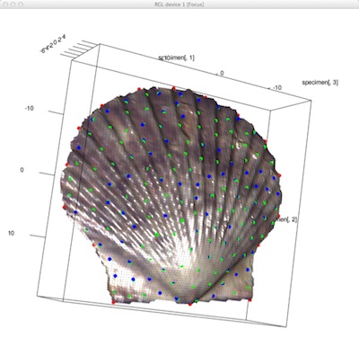 

Select all of the fixed landmarks, and then the function will calculate the position of the surface sliding landmarks on the mesh based on the template (blue), and plot them in green.

Function writes to the working directory an NTS file with the name of the specimen and .nts suffix containing the landmark coordinates. 

*myply2.nts*
```
"myply2
1 166 3 0 dim=3
13.6450089578878 9.85741717491749 -3.49156546534654
9.70490895788779 18.3504171749175 -1.90256546534653
-2.33683104211221 17.5362171749175 0.855334534653466
-14.1518710421122 15.2515171749175 1.06203453465347
-14.1681010421122 6.40941717491749 0.853034534653467
...
```
YouTube video of this function in action here: http://youtu.be/4S8XcMMgUyw

### AUTO mode
The function as described above (for interactive mode) calls `digit.fixed`, prompting the user to select fixed landmarks in the rgl window. However if the user has digitized these fixed landmark elsewhere (e.g., in other software), then the input for parameter 'fixed' can be a p-x-k matrix of 3D coordinates. In this case, the function will automatically use these landmarks and fit the template of sliding semilandmarks.

##	Calculate semilandmarks along a curve (`digit.curves`)
A function to calculate equidistant two-dimensional and three-dimensional semilandmarks along a curve. These landmarks will be treated as "sliders" in Generalized Procrustes analysis gpagen. This type of semilandmark "slides" along curves lacking known landmarks (see Bookstein 1997 for algorithm details). Each sliding semilandmark ("sliders") will slide between two designated points, along a line tangent to the specified curvature, as specified by `define.sliders`.
**Function**  
```{r eval=FALSE}
digit.curves(start, curve, nPoints, closed=TRUE)
```
**Arguments**  

 * *start*	A vector of coordinates for the fixed landmark defining the start of the curve
 * *curve*	A p-x-k matrix of 2D or 3D coordinates for a set of ordered points defining a curve
 * *nPoints*	Numeric how many semilandmarks to place equidistantly along the curve
 * *closed*	Logical Whether the curve is closed (TRUE) or open (FALSE)

The function is based upon tpsDig2 'resample curve by length' for 2D data by James Rohlf. The start of the curve is a fixed landmark on the curve that is equivalent (homologous) in each specimen in the sample (and will be treated as a fixed point during Procrustes Superimposition using gpagen). Then nPoints are calculated along the curve at equidistant points from the start to the end.

'curve' is a p-x-k matrix of 2D or 3D coordinates for a set of ordered points defining a curve. This can be the pixels of an outline calculated in ImageJ (save xy coordinates), or obtained by automatically thresholding a jpeg using Momocs import_jpg function (https://github.com/vbonhomme/Momocs/), or any other reasonable way of obtaining ordered coordinates along a curve (including sampling by hand using `digit.fixed` or `digitize2d` - but note that there should be more points defining the curve than nPoints in order to accurately calculate the semilandmarks).

If 'closed = T', the function returns the coordinates of the 'start' landmark plus nPoints. If 'closed = F', the function returns the coordinates of the 'start' landmark, plus nPoints and the end of the curve.

**Example**
Here we have an outline of a leaf, exported as a .txt file of x,y, coordinates from ImageJ (see `warpRefOutline` for details on how this can be done).
```{r eval=F}
curve <- as.matrix(read.table("Chusquea pittieri_1.txt", skip=4))
start <- c(8.5143, 11.8367) # know the coordinates of the start of the curve
plot(curve, asp=T, pch=19, cex=0.1) # plot the curve
points(start[1], start[2], pch=19, cex=0.5, col="red") # show the starting point
```

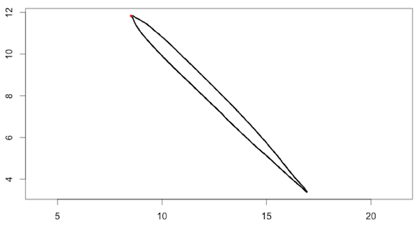 

 
```{r eval=F}
lmks <- digit.curves(start, curve, nPoints=20, closed = T) # run function
points(lmks[,1], lmks[,2], pch=19, cex=0.5, col="green") # plot the sampled points

lmks
         [,1]    [,2]
 [1,]  8.5143 11.8367
 [2,]  9.4671 11.2816
 [3,] 10.3347 10.5267
 [4,] 11.1673  9.7204
 [5,] 11.9918  8.9059
 [6,] 12.8146  8.0898
 [7,] 13.6082  7.2609
 [8,] 14.3863  6.4327
 [9,] 15.1347  5.5750
[10,] 15.8599  4.6939
[11,] 16.5762  3.8367
[12,] 16.5224  3.7333
[13,] 15.6810  4.4980
[14,] 14.8422  5.2653
[15,] 14.0000  6.0294
[16,] 13.1725  6.8082
[17,] 12.3579  7.6163
[18,] 11.5347  8.4156
[19,] 10.7045  9.2082
[20,]  9.8901 10.0327
[21,]  9.1102 10.8917
```

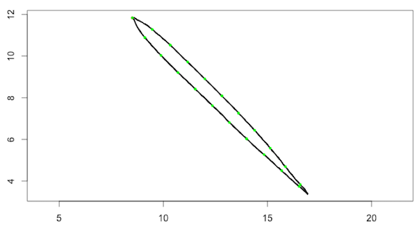 


______

# Frequently Asked Questions
This section will cover some of *geomorph's* frequently asked questions. 

1)	I’ve loaded my TPS file but I get a warning that no names were extracted. My TPS file has specimen names in it, what do I do?
- For TPS files it is necessary to specify whether the specimen name should be read from the “ID=” line or the “IMAGE=” line. See chapter 2 for more details.

2)	I want to add a groups to my data analysis, what do I do?
- Grouping variables can be made in *R* (e.g., c()) or imported from outside (e.g., as a .csv file). See chapter 3 for more details.

3)	How many iterations should I use in permutation tests?
- The default for *geomorph* functions is often 999. Generally more is better, but too many can be excessive and does not lead to more power. See section on permutation tests in the introduction for more details.

4)	How do I reflect my specimens before using `gpagen` or `bilat.symmetry`? 
- Reflecting a set of specimens may be accomplished by multiplying one coordinate dimension by '-1' for these structures (either the x-, the y-, or the z-dimension). To do this:

```{r eval = FALSE}
mydata # this is your 3D array of raw variables needing to be reflected
refl <- array(1, dim=dim(mydata)) # make an array the same dimensions as mydata and fill it with 1s
refl[,1,] <- -1 # replace the x coordinate column with -1
mydata <- mydata * refl # multiply the two arrays to reflect
```

5)	I’ve loaded my TPS file and I got a warning that “Not all specimens have scale...”. I defined a scale by digitizing two landmarks on the scale bar, what do I do? 
- Let’s say that landmarks 47 and 48 define the ends of the 10mm scale bar, and coords is a 3D array of the raw coordinate data:

```{r eval = FALSE}
for (i in 1:dim(coords)[3]){
    scb <- coords[47:48,,i]
    scale <- sqrt((scb[1,1]-scb[2,1])^2+(scb[1,2]-scb[2,2])^2)/1000
    coords[,,i] <- coords[,,i]*scale }
coords <- coords[-(47:48),,] # remove the landmarks
```

# References

Adams, D. C. 1999. Methods for shape analysis of landmark data from articulated structures. Evol. Ecol. Res. 1:959-970.
Adams, D. C. 2014. A generalized K statistic for estimating phylogenetic signal from shape and other high-dimensional multivariate data. Syst. Biol. 63:685-697.
---. 2014. A method for assessing phylogenetic least squares models for shape and other high-dimensional multivariate data. Evolution 68:2675-2688.
---. 2016. Evaluating modularity in morphometric data: Challenges with the RV coefficient and a new test measure. Methods in Ecology and Evolution. (Accepted).
Adams, D. C., and C. D. Anthony. 1996. Using randomization techniques to analyse behavioural data. Anim. Behav. 51:733-738.
Adams, D. C., and M. M. Cerney. 2007. Quantifying biomechanical motion using Procrustes Motion Analysis. J. Biomech. 40:437-444.
Adams, D. C., and M. L. Collyer. 2007. The analysis of character divergence along environmental gradients and other covariates. Evolution 61:510-515.
---. 2009. A general framework for the analysis of phenotypic trajectories in evolutionary studies. Evolution 63:1143-1154.
Adams, D. C., and R. Felice. 2014. Assessing phylogenetic morphological integration and trait covariation in morphometric data using evolutionary covariance matrices. Plos ONE 9:e94335.
Adams, D. C., and A. Nistri. 2010. Ontogenetic convergence and evolution of foot morphology in European cave salamanders (Family: Plethodontidae). BMC Evol. Biol. 10:216.
Adams, D. C., F. J. Rohlf, and D. E. Slice. 2004. Geometric morphometrics: ten years of progress following the 'revolution'. Italian Journal of Zoology 71:5-16.
Adams, D. C., F. J. Rohlf, and D. E. Slice. 2013. A field comes of age: geometric morphometrics in the 21st century. Hystrix 24:7-14.
Anderson, M. J. 2001. A new method for non-parametric multivariate analysis of variance. Austral. Ecol. 26:32-46.
Anderson, M. J., and C. J. F. terBraak. 2003. Permutation tests for multi-factorial analysis of variance. Journal of Statistical Computation and Simulation 73:85-113.
Blomberg, S. P., T. Garland, and A. R. Ives. 2003. Testing for phylogenetic signal in comparative data: behavioral traits are more labile. Evolution 57:717-745.
Bookstein, F. L. 1991. Morphometric tools for landmark data: geometry and biology. Cambridge Univ. Press,, New York.
Bookstein, F. L. 1997. Shape and the information in medical images: A decade of the morphometric synthesis. Computer Vision and Image Understanding 66:97-118.
---. 2015. Integration, disintegration, and self-similarity: Characterizing the scales of shape variaiton in landmark data. Evol. Biol.
Bookstein, F. L., P. Gunz, P. Mitteroecker, H. Prossinger, K. Schaefer, and H. Seidler. 2003. Cranial integration in Homo: singular warps analysis of the midsagittal plane in ontogeny and evolution. J. Hum. Evol. 44:167-187.
Claude, J. 2008. Morphometrics with R. Springer.
Collyer, M. L., and D. C. Adams. 2007. Analysis of two-state multivariate phenotypic change in ecological studies. Ecology 88:683-692.
---. 2013. Phenotypic trajectory analysis: comparison of shape change patterns in evolution and ecology. Hystrix 24:75-83.
Collyer, M. L., D. J. Sekora, and D. C. Adams. 2015. A method for analysis of phenotypic change for phenotypes described by high-dimensional data. Heredity 115:357-365.
Drake, A. G., and C. P. Klingenberg. 2008. The pace of morphological change: historical transformation of skull shape in St Bernard dogs. Proc. R. Soc. B 275:71-76.
Dryden, I. L., and K. V. Mardia. 1993. Multivariate shape analysis. Sankhya 55:460--480.
Good, P. 2000. Permutation tests: a practical guide to resampling methods for testing hypotheses. Springer, New York.
Goodall, C. 1991. Procrustes methods in the statistical analysis of shape. Journal of the Royal Statistical Society. Series B (Methodological):285-339.
Gower, J. C. 1975. Generalized Procrustes analysis. Psychometrika 40:33-51.
Gunz, P., P. Mitterocker, and F. L. Bookstein. 2005. Semilandmarks in three dimensions. Pp. 73-98 in D. E. Slice, ed. Modern morphometrics in physical anthropology. Kluwer Academic/Plenum Publishers, New York.
Gunz, P., P. Mitteroecker, S. Neubauer, G. W. Weber, and F. L. Bookstein. 2009. Principles for the virtual reconstruction of hominin crania. J. Hum. Evol. 57:48-62.
Kendall, D. G. 1984. Shape-manifolds, Procrustean metrics and complex projective spaces. Bulletin of the London Mathematical Society 16:81-121.
Klingenberg, C. P. 2009. Morphometric integration and modularity in configurations of landmarks: tools for evaluating a priori hypotheses. Evol. Dev. 11:405-421.
Klingenberg, C. P., M. Barluenga, and A. Meyer. 2002. Shape analysis of symmetric structures: quantifying variation among individuals and asymmetry. Evolution 56:1909-1920.
Klingenberg, C. P., and N. A. Gidaszewski. 2010. Testing and quantifying phylogenetic signals and homoplasy in morphometric data. Syst. Biol. 59:245-261.
Klingenberg, C. P., and G. S. McIntyre. 1998. Geometric morphometrics of developmental instability: Analyzing patterns of fluctuating asymmetry with procrustes methods. Evolution 52:1363-1375.
Mardia, K. V., F. L. Bookstein, and I. J. Moreton. 2000. Statistical assessment of bilateral symmetry of shapes. Biometrika 87:285-300.
Mitteroecker, P., and P. Gunz. 2009. Advances in geometric morphometrics. Evol. Biol. 36:235-247.
Mitteroecker, P., P. Gunz, M. Bernhard, K. Schaefer, and F. L. Bookstein. 2004. Comparison of cranial ontogenetic trajectories among great apes and humans. J. Hum. Evol. 46:679-697.
O'Higgins, P., and N. Jones. 1998. Facial growth in Cercocebus torquatus: an application of three-dimensional geometric morphometric techniques to the study of morphological variation. J. Anat. 193:251-272.
Revell, L. J. 2012. phytools: an R package for phylogenetic comparative biology (and other things). Methods in Ecology and Evolution 3:217-223.
Rohlf, F. J. 1998. On applications of geometric morphometrics to studies of ontogeny and phylogeny. Syst. Biol. 47:147-158.
Rohlf, F. J. 1999. Shape statistics: Procrustes superimpositions and tangent spaces. J. Classif. 16:197-223.
Rohlf, F. J. 2002. Geometric morphometrics and phylogeny. Pp. 175-193 in N. MacLeod, and P. L. Forey, eds. Morphology, shape and phylogeny. Francis & Taylor, London.
---. 2010. tpsRelw: Relative warp analysis. Version 1.49. Version 1.49. Department of Ecology and Evolution, State University of New York at Stony Brook, Stony Brook, NY.
---. 2012. NTSYSpc: Numerical taxonomy and multivariate analysis system. Version 2.2. New York: Exeter Software.
Rohlf, F. J., and M. Corti. 2000. Use of two-block partial least-squares to study covariation in shape. Syst. Biol. 49:740-753.
Rohlf, F. J., and L. F. Marcus. 1993. A revolution in morphometrics. Trends Ecol. Evol. 8:129-132.
Rohlf, F. J., and D. Slice. 1990. Extensions of the Procrustes method for the optimal superimposition of landmarks. Syst. Zool. 39:40-59.
Zelditch, M. L., D. L. Swiderski, and H. D. Sheets. 2012. Geometric morphometrics for biologists: a primer. 2nd ed. Elsevier, Amsterdam.


